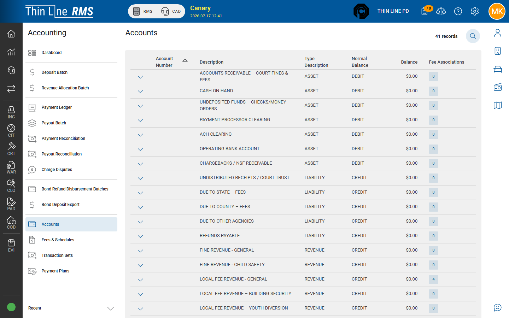

# Accounts, fees, and plans

Configuration and inquiry screens used by court finance.

## Accounts

1. Open **Accounting** → **Accounts**.
2. Review account number, description, type, normal balance, balance, and fee associations.
3. Expand an account to see fee codes and allocated %.

Agency users typically **view** the chart here. Structural chart changes are coordinated with Thin Line — do not expect full self-service add/edit in every build.

## Fees & Schedules

1. Open **Accounting** → **Fees & Schedules**.
2. Use tabs **Fees**, **Schedules**, and **Versions** as shown.
3. **Add Fee** / edit only under your agency’s approved ordinance and fee-schedule process.

Fee allocation percentages drive [Revenue allocation](revenue-allocation.md).

## Transaction Sets

1. Open **Accounting** → **Transaction Sets**.
2. Search and expand line detail when researching how a payment posted.
3. **Print Receipt** for payment (PAY) sets when offered.

**Support only:** Reallocate Funds and Reverse transaction set — not agency training tools. Escalate erroneous posts to Thin Line instead of inventing a local reverse.

## Payment Plans

1. Open **Accounting** → **Payment Plans**.
2. Search across cases for inquiry.
3. **View Payment Plan** opens the Court payment-plan dialog.

Create, cancel, and day-to-day plan management stay on the [Court case](../court/payment-plans.md).

## Related

- [From Court payments](from-court-payments.md)
- [Revenue allocation](revenue-allocation.md)
