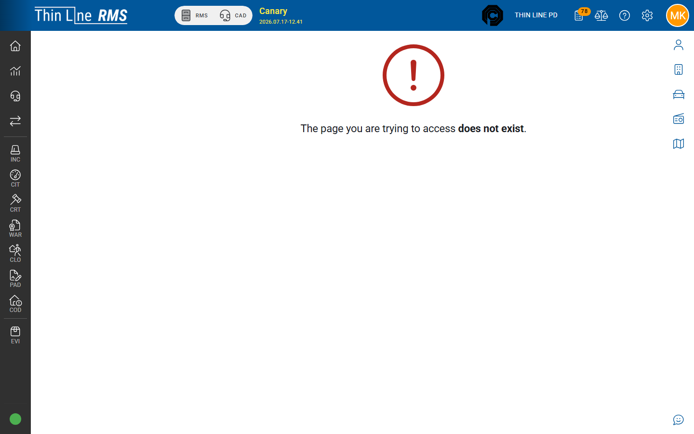

# Bonds

Bond refund disbursement and bond deposit export tools in Accounting.

## Bond Refund Disbursement Batches

Pay out exonerated cash bonds that are ready for refund.

### Create a batch

1. Open **Accounting** → **Bond Refund Disbursement Batches**.
2. Choose **New Batch**.
3. Set the resolved period and **Disbursement Date**.
4. Choose **Find Eligible**.
5. Select bonds (empty message: no eligible exonerated cash bonds in the period).
6. **Create Batch**.

### Post the batch

1. Open the batch detail.
2. Enter **Check #** (required) and confirm **Disbursement Date**.
3. **Post Bond Refund Batch** — posts check-clearance GL (bond escrow / operating bank) and marks bonds **REFUNDED**.

### Void

**Void** reverses GL and returns bonds toward exonerated / refund-pending. **Void Reason** is required. Coordinate with court before voiding.

## Bond Deposit Export

Reconcile bond deposits to deposit batches.

1. Open **Accounting** → **Bond Deposit Export**.
2. Set **Posted Date** range (required).
3. Optionally filter **Pending deposit only**.
4. **Search**, then **Export CSV** as needed.

Columns typically include bond #, receipt #, deposit status, deposit batch, defendant/depositor, and linked violations. Use the pending total when not all bonds are fully deposited.

## Case-level bonds

Issue / exonerate / related court actions live on the court case — see [Court — FTA, warrants, and bonds](../court/fta-warrants-bonds.md).

## Related

- [Deposit batches](deposit-batches.md)
- [Court — FTA, warrants, and bonds](../court/fta-warrants-bonds.md)
