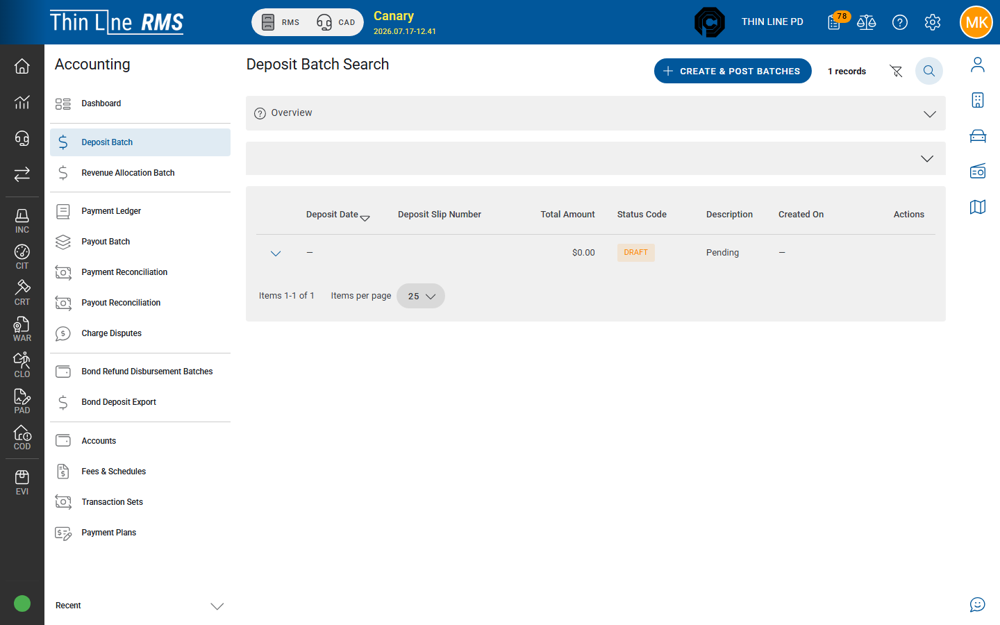

# Deposit batches

Group accepted payment transaction sets for bank deposit and post them.

## What a deposit batch does

When posted, funds move from clearing toward your **operating bank** accounting path. Batches can include cash, checks, processor clearing, and ACH clearing. The product expects **one deposit batch per agency per date**.

## Create and post

1. Open **Accounting** → **Deposit Batch**.
2. Choose **Create & Post Batches**.
3. Review pending transaction sets (Transaction #, Date, Amount, Payment Method, Description).
4. Select the rows to include (default is often all pending).
5. Confirm **Create & Post Batches**.

If you see **No transactions in the pending batch**, nothing accepted is waiting — return to [From Court payments](from-court-payments.md).

## Search existing batches

Filter by agency, status (**DRAFT** / **POSTED** / **VOIDED**), deposit slip number, deposit date range, and amount range as shown. A synthetic **Pending** row may appear for work not yet batched.

## After post

Typical row actions on posted batches:

| Action | Use |
|--------|-----|
| Payment settlement report | Print / review settlement output |
| Export journal entries | **Tyler ERP** or **CentralSquare Asyst** when your city uses those exports. Combined **pending bundle** exports renumber transaction numbers so a single merged CentralSquare file does not reuse the same Trans Number across batches |
| **Void Batch** | Reverse a DRAFT or POSTED batch — **Void Reason** required |

## City GL export and handoff

When your city uses **City GL** exports, download them from the batch row alongside Tyler ERP and CentralSquare. After importing into the city ledger, mark the export **complete** on the **GL Export Queue** so finance staff can see what still needs city-side import.

## Tips

- Align deposit date with the physical bank deposit.
- Void carefully — coordinate with your finance lead before voiding posted batches.
- Card/online paths also appear in [Online payments and payouts](online-payments-and-payouts.md); do not double-count the same money in two mental “deposits.”

## Related

- [Revenue allocation](revenue-allocation.md)
- [Reconciliation and disputes](reconciliation-and-disputes.md)
