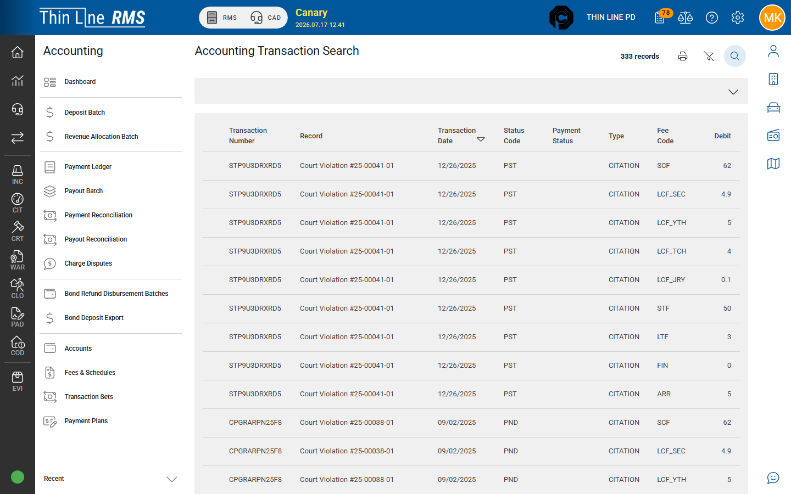

# From Court payments

How money on a court case becomes work in Accounting.

## External / off-platform Apply Payment (Court)

1. Open the court violation ([Court](../court/README.md)).
2. On **Accounting**, use **Apply Payment/Credit** for money collected outside Thin Line — amount, method, date.
3. The payment updates the case balance and sits **pending acceptance**; it does **not** create general ledger lines or join deposit/revenue batches at apply time.
4. Accept from the payment acceptance work queue (**Payment - Accept New** / **Batch Accept Payments** as your agency uses).
5. Issue the **final receipt** only after acceptance.

**Access:** Apply Payment/Credit on Accounting is Thin Line **full support** on current builds. In-person and online citation payment flows (when enabled) remain the day-to-day collection paths for agency cashiers.

Details: [Court — Payments](../court/payments.md).

## What Accounting receives

Online / in-person processor payments and other ledger-tracked payments become **transaction sets** that appear in pending batches for:

| Accounting tool | Role |
|-----------------|------|
| [Deposit batches](deposit-batches.md) | Group clearing / cash / check / processor amounts for bank deposit |
| [Revenue allocation](revenue-allocation.md) | Move court trust liability into revenue by fee allocation |
| [Online payments and payouts](online-payments-and-payouts.md) | Track Stripe online payments and bank payouts |

If a payment never appears in a pending deposit batch, check whether it was an **external Apply Payment** (balance-only, no GL), then **acceptance**, **agency**, and **date** — not the deposit screen alone.

## Payment plans

Create and manage plans on the **Court** case ([Payment plans](../court/payment-plans.md)). Accounting **Payment Plans** search is primarily **inquiry** across plans.

## Fees and balances on the case

Court **Manage Fees/Balances** (when used) changes what is owed on the violation. Fee schedule definitions live under Accounting [Fees & Schedules](accounts-fees-and-plans.md).

## Tips

- External Apply Payment does not create deposit/revenue batch work — do not expect Create & Post for those PAY rows.
- For ledger-tracked window/online payments, cashiers stop at apply + accept; finance owns Create & Post Batches.
- One physical drawer day should map cleanly to deposit date and agency — avoid mixing agencies in one close-out.

## Related

- [Deposit batches](deposit-batches.md)
- [Journey: Court payment to accounting](../getting-started/journeys/court-payment-to-accounting.md)
