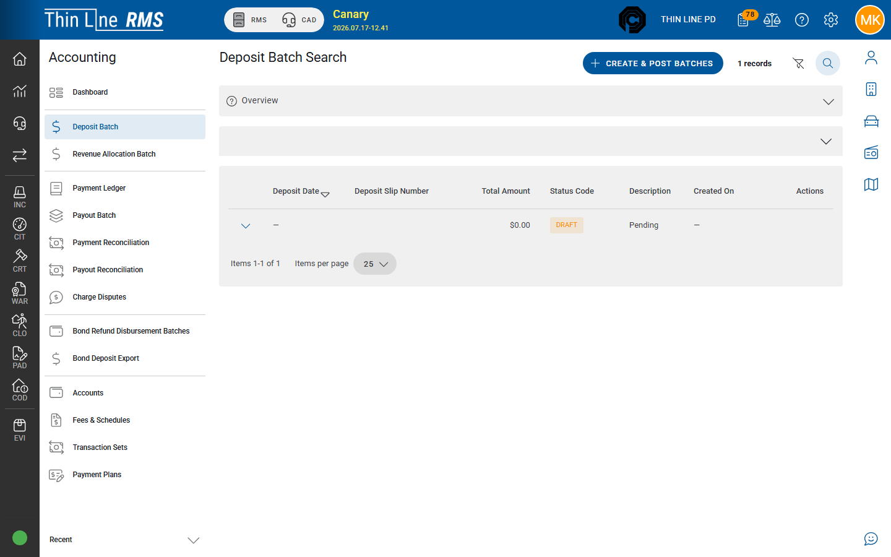

# Reconciliation and disputes

Verify Thin Line settlement data against the card processor, and track chargebacks.

## Payment Reconciliation

1. Open **Accounting** → **Payment Reconciliation**.
2. Review verify runs (daily job and/or **Run Now**).
3. Set lookback days as needed.
4. Prefer **VerifyOnly** for routine checks.

**VerifyAndHeal** can modify settlement/ledger data to correct mismatches — use only with finance lead approval and a clear reason.

## Payout Reconciliation

1. Open **Accounting** → **Payout Reconciliation**.
2. Run or review verifies against payout / settlement batches.
3. Same caution on VerifyAndHeal — it may create or update batches.

## Charge Disputes

1. Open **Accounting** → **Charge Disputes**.
2. Search synced chargeback / dispute rows.
3. Act on open disputes in the **Stripe Dashboard** (Thin Line syncs status; dispute response is not completed only inside RMS).
4. Use **Sync Now** with a lookback if a dispute is missing after it appeared in Stripe.

Expand a row when you need payload / webhook detail for Support.

## Tips

- Reconcile on a fixed cadence so heal is rare.
- Escalate persistent mismatches to Thin Line with dates, payout ids, and whether VerifyAndHeal was used.

## Related

- [Online payments and payouts](online-payments-and-payouts.md)
- [Support](../support/README.md)
