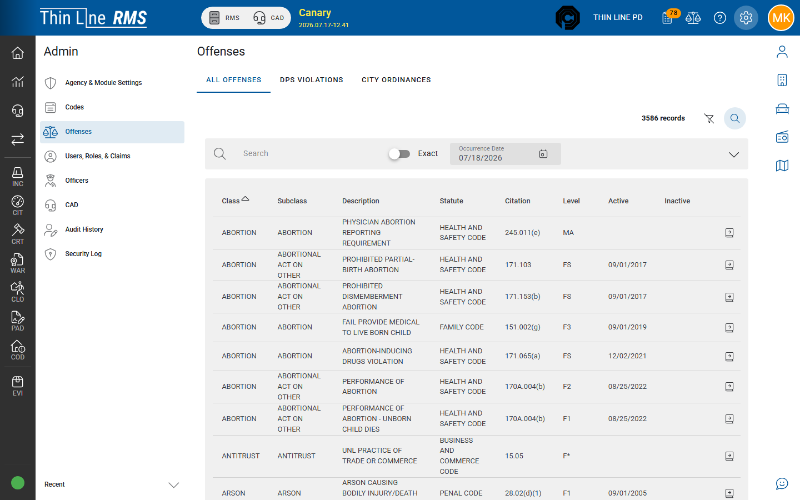

# Offenses

Maintain the offense / ordinance catalog used on citations, incidents, warrants, and court cases.

## Open Offenses

1. Open **Admin**.
2. Choose **Offenses**.

Requires the offenses-administration claim.

## Tabs (typical)

| Tab | Contents |
|-----|----------|
| **All** | Combined offense view |
| **DPS Violations** | State / DPS-style catalog entries your tenant uses |
| **City Ordinances** | Local ordinance offenses your agency maintains |

Exact tab labels follow your build. City ordinances are usually where agencies add local-only charges.

## Typical workflow

1. Search for an existing offense before adding a duplicate.
2. Open an offense to review statute / ordinance identifiers and descriptions.
3. Add or edit city ordinances when your agency’s legal process has approved the text.
4. Save, then test from a citation or incident offense picker.

## Tips

- Coordinate offense text with your prosecutor / municipal attorney before go-live.
- Prefer one offense row per real charge; duplicates confuse officers and court import.
- Offense Search in the header (when available) is a quick lookup — it does not replace Admin maintenance.

## Related

- [Codes](codes.md)
- [Citations — Offenses and warnings](../rms/citations/offenses-and-warnings.md)
- [Court](../court/README.md)
