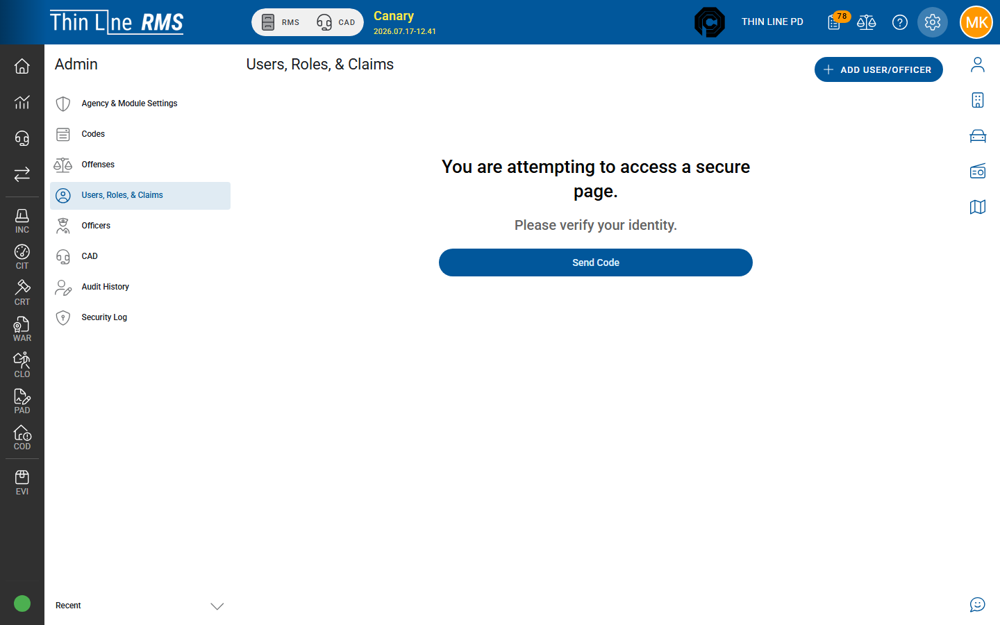

# Users, roles, and claims

Create and maintain Thin Line accounts and permissions.

## Open Users

1. Open **Admin**.
2. Choose **Users, Roles, & Claims**.
3. Complete **step-up** authentication if prompted.

You need the user-administration claim (`Admin.User.Modify` or your agency’s equivalent).

## Tabs

| Tab | Purpose |
|-----|---------|
| **Users** | Search, add, invite, edit, terminate accounts |
| **Roles** | Reference map of roles and which claims they include |
| **Claims** | Reference map of claims and who holds them |

Assign permissions from a user’s **Edit Permissions** action. Roles and Claims tabs are primarily for review.

## Add a user (typical)

1. Choose **Add User/Officer** (label may vary slightly by build).
2. Enter account identity (name, username, email). You can use a temporary email and update it later.
3. Add officer details when the person will cite or appear as an officer.
4. Assign **roles** and/or individual **claims**.
5. Save, then **invite** or issue credentials per your agency process.

Temporary passwords shown at invite time are often **not viewable again** — capture them securely at creation.

## Edit permissions

1. Find the user on the **Users** tab.
2. Open **Edit Permissions**.
3. Add or remove roles and claims that match their job (RMS, Court, Jail, CAD, Admin as needed).
4. Save and have the user sign out and back in if menus do not refresh.

Least privilege: grant only what the role needs for production work.

## Common account actions

| Action | When to use it |
|--------|----------------|
| **Invite** / send credentials | New hire or first login |
| **Active / inactive** | Temporary leave or staged access |
| **Revoke access** / lock | Suspected compromise or separation in progress |
| **Terminate** | Permanent end of employment — destructive; confirm before use |
| **Make Officer** | Link an existing user to an officer profile |

## Tips

- Keep a short internal list of who may hold Admin user claims.
- After go-live, review accounts that still have broad claims from training.
- Officer badge and photo details also live under [Officers](officers.md).

## Related

- [Officers](officers.md)
- [Opening Admin](opening-admin.md)
- [FAQ](../support/faq.md)
