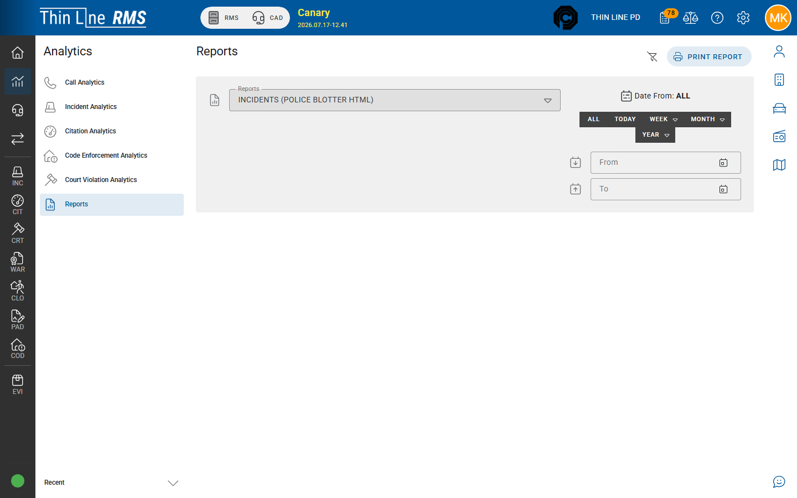

# Charts

Interactive analytics views (labels match the product menu).

| Menu item | Typical use |
|-----------|-------------|
| **Call Analytics** | CAD call volume and patterns (CAD enabled + access) |
| **Incident Analytics** | Incident activity trends |
| **Citation Analytics** | Citation activity trends |
| **Code Enforcement Analytics** | Code enforcement case trends |
| **Court Violation Analytics** | Court case / violation trends |

## How to use a chart

1. Open the chart from **Analytics**.
2. Set the date range and any filters shown.
3. Read the chart for trends; drill into underlying modules when you need a specific record.
4. Do not treat charts as the system of record for case decisions.

## Related

- [Opening Analytics](opening-analytics.md)
- [Incidents](../rms/incidents/README.md) · [Citations](../rms/citations/README.md) · [Code Enforcement](../rms/code-enforcement/README.md) · [Court](../court/README.md)
