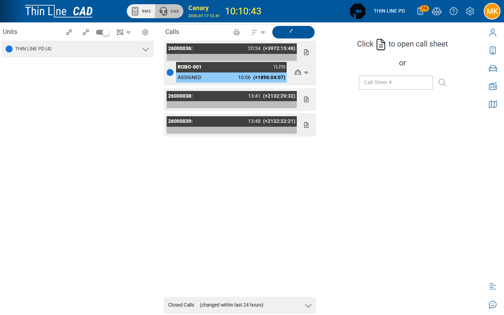

# Create and update a call

Create a call for service and keep the header fields accurate.

## Add a call

1. Open [live CAD](live-cad-overview.md).
2. On the **Calls** panel toolbar, choose **Add Call** (requires full CAD modify).
3. The new call opens and the call sheet loads (brief highlight on the new card).
4. Immediately set **Call Type** and **Location** — the header stays incomplete (error styling) until both are present.

## Open an existing call sheet

| Method | Action |
|--------|--------|
| Call card | Use **Open Call Sheet** / details control |
| Call Sheet # | Enter the number on the empty sheet and search |
| Deep link | `/cad/{callNumber}` |

**Close Call Sheet** unloads the right panel only — the call stays open on the board.

## Header fields

Edit on the call sheet (values save when changed). Lists are agency codes.

| Field | Purpose |
|-------|---------|
| **Call Type** | What kind of call (required for a complete header) |
| **Priority** | Dispatch priority (non-default priorities stand out on the card) |
| **How Reported** | How the call was received (phone, officer, etc.) |
| **Location** | Master location / address (required for a complete header) |

Collapsed summary typically shows Call Type, Location, and Priority (when not the default). Missing Call Type or Location shows as incomplete.

## Call card at a glance

Open call cards show call number and type, time / elapsed, location, priority or status, and a strip of uncleared units. Use the strip to clear units without opening the full sheet — see [Assign and clear units](assign-and-clear-units.md).

## Closed Calls

Expand **Closed Calls** under the open list to see calls that changed to closed in about the last 24 hours. Full history belongs in [CAD Records — Call sheets](records/call-sheets.md).

## Tips

- Prefer an existing [master location](../getting-started/master-records/locations.md) so later incidents and search stay consistent.
- Do not create a second call for the same event if the first is still open — update the existing sheet.
- Officers on [self-dispatch](self-dispatch.md) can also add calls when Available and not already on a call.

## Related

- [Call sheet activity](call-sheet-activity.md)
- [Dispose and close a call](dispose-and-close-a-call.md)
