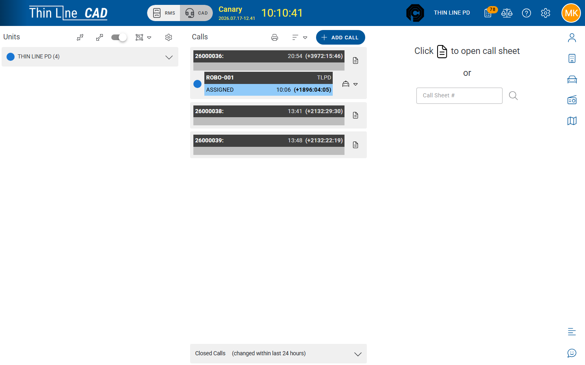

# Live CAD overview

Open the full dispatch console and understand the three panels.

## Open live CAD

1. Confirm you are in the correct **agency** (header).
2. Confirm your account has **full CAD** access and the agency has CAD enabled.
3. In the header, switch product mode to **CAD**.
4. The console opens at `/cad` with three columns.

If you only need history, stay in **RMS** and use [CAD Records](records/README.md) — do not take over the live board for research.

## Three-panel layout

| Panel | What you see | Typical actions |
|-------|--------------|-----------------|
| **Units** (left) | Active units; group by Agency / Status / None; Hide Inactive | Change unit status; drag onto a call; Manage Units (CAD admin) |
| **Calls** (center) | Open call cards; sort Priority / Newest / Oldest | **Add Call**; open call sheet; clear units on the card; expand **Closed Calls** (last ~24 hours) |
| **Call Sheet** (right) | Detail for the selected call | Header fields, quick entry, activity timeline |

Empty call sheet: use the details control on a call card, or jump by **Call Sheet #**. Deep link format: `/cad/{callNumber}`.

## Floating Dispatcher Notes

A **Dispatcher Notes** control opens agency-wide notes (separate from notes on a single call). See [Dispatcher notes](dispatcher-notes.md).

## Permissions (high level)

| Need | Typical requirement |
|------|---------------------|
| Open full CAD | Full CAD access + agency CAD enabled |
| Add calls, assign/clear units, dispatcher notes | Full CAD **modify** |
| Edit call sheet / Related Incidents & Citations | Combined CAD modify (as granted) |
| Self-dispatch only | Dashboard path — see [Self-dispatch](self-dispatch.md) |
| Manage Units | CAD admin |

View-only users can watch the board but cannot Add Call or drag-assign. If the header has no **CAD** mode, ask your administrator — see [Admin](../admin/README.md).

## Tips

- Closing the call sheet (X / Close Call Sheet) only hides the right panel — it does **not** dispose the call.
- Print from the Calls area typically opens historical Call Sheet Search in [CAD Records](records/call-sheets.md).
- Agency code lists drive Call Type, Priority, How Reported, and Disposition — maintain them under [Admin — Codes](../admin/codes.md).

## Related

- [Create and update a call](create-and-update-a-call.md)
- [Assign and clear units](assign-and-clear-units.md)
- [Journey: CAD call to incident](../getting-started/journeys/cad-call-to-incident.md)
