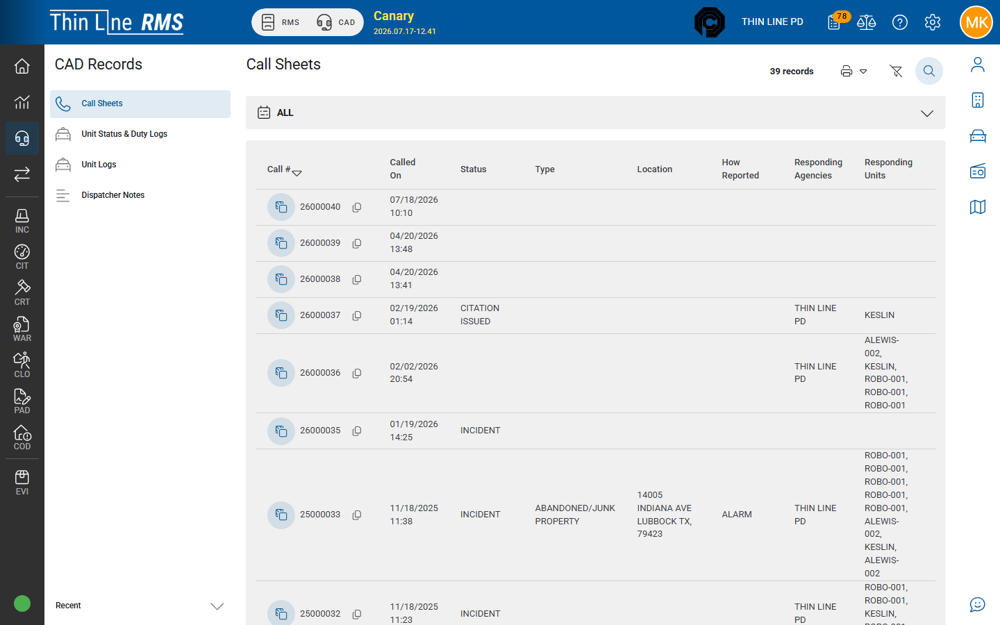

# Call sheets

Search historical CAD call sheets.

## Steps

1. Open **CAD Records** from the left rail.
2. Choose **Call Sheets**.
3. Enter call number, dates, location, or other criteria.
4. Open a result to review the historical call sheet.

## Tips

- Use this for records requests and follow-up — not for managing active units.
- If you need the live call, switch to header **CAD**.

## Related

- [Unit status and logs](unit-status-and-logs.md)
- [Live CAD overview](../live-cad-overview.md)
