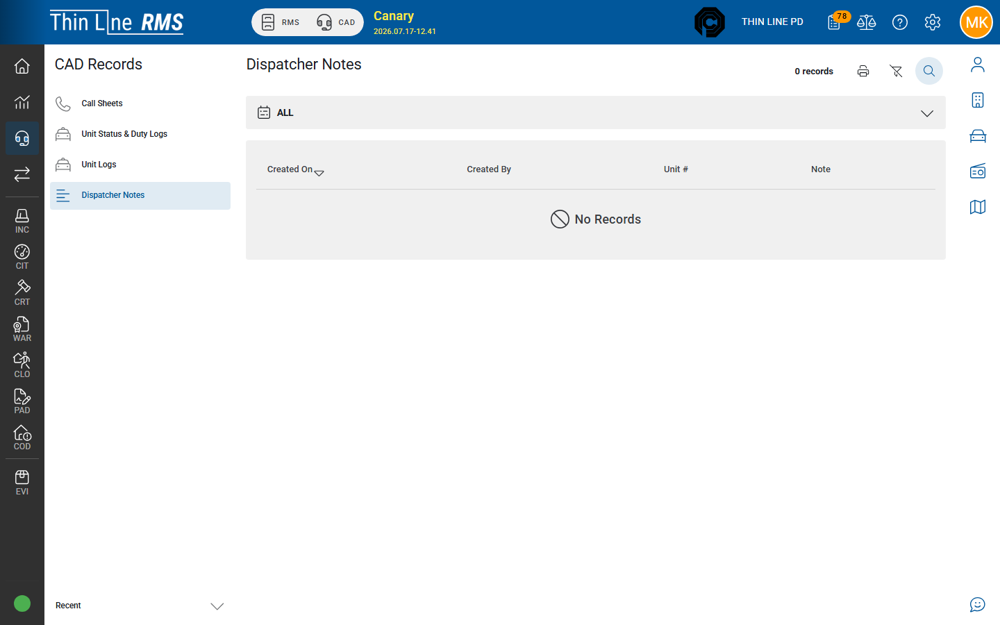

# Dispatcher notes

1. Open **CAD Records** → **Dispatcher Notes**.
2. Search by date, call, or text criteria shown.
3. Open a note to review context.

Use for QA and historical research. Live **agency-wide** note entry is [Dispatcher notes](../dispatcher-notes.md) on the console; **call** notes are on the call sheet ([Call sheet activity](../call-sheet-activity.md)).

## Related

- [Call sheets](call-sheets.md)
- [Dispatcher notes (live)](../dispatcher-notes.md)
- [Live CAD overview](../live-cad-overview.md)
