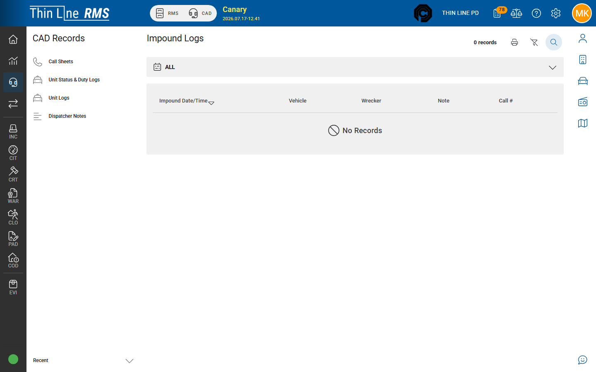

# Impound and LETS

## Impound Logs

1. Open **CAD Records** → **Impound Logs** (when your agency enables this destination).
2. Search impound activity by date, plate, or other criteria.
3. Open a row for detail.

## LETS Queries

1. Open **CAD Records** → **LETS Queries** (requires LETS query access).
2. Search historical LETS query activity your agency retains in Thin Line.
3. Follow CJIS / agency policy for viewing and disseminating query results.

## Tips

- LETS access is tightly controlled — do not share query output outside authorized channels.

## Related

- [Call sheets](call-sheets.md)
- [Support](../../support/README.md)
