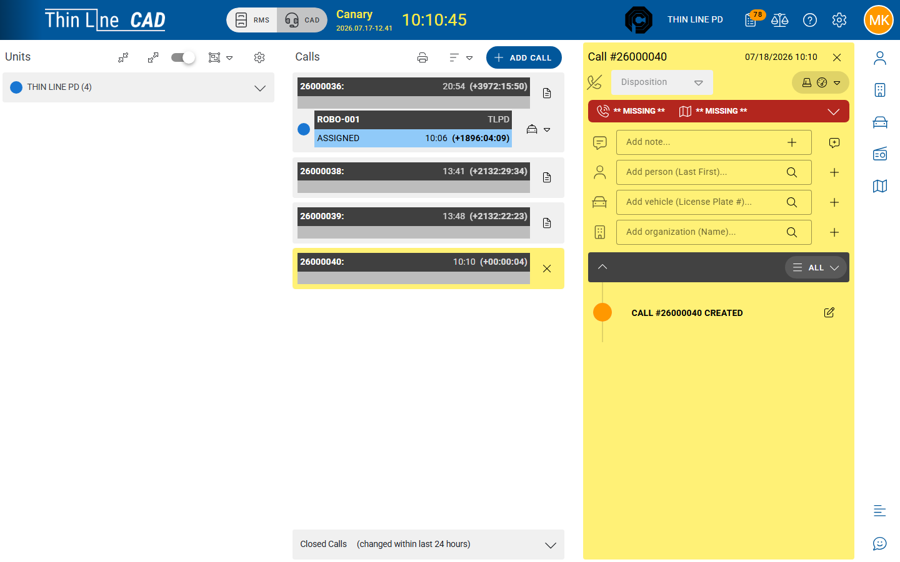

# Related incidents and citations

Create or link RMS incidents (and link citations) from the live call sheet.

## Open Related Incidents & Citations

1. Open the call sheet.
2. Choose **Related Incidents & Citations** (requires the CAD modify rights your agency grants for this control).
3. Work per agency that has a unit on the call (or already has a linked module record).

## Create Incident

1. Confirm at least one unit from the target agency is **on the call** (Create Incident stays disabled until that agency has a unit assigned).
2. Choose **Create Incident**.
3. Confirm the success message (for example that an incident was created).
4. Open the new incident from the related list (incident number chip/button).
5. Complete narratives, offenses, and involved parties in [Incidents](../rms/incidents/README.md).
6. Submit for approval per agency workflow.

Opening the incident also requires incidents enabled for the agency and incident access on your user.

## Link an existing record

1. Choose **Link Existing Record**.
2. Set **Record Type** to **Incident** or **Citation**.
3. Choose agency and enter the incident number or citation number.
4. Choose **Link**.
5. Confirm the record appears under Related Incidents & Citations.

Use link when the RMS record already exists and should point back to this call.

## Citations from CAD

**Create Citation** from the CAD related menu is **not** a live customer action in current builds. Officers create citations in [Citations](../rms/citations/README.md) (or mobile citations), then **link** them here when needed.

## When not to create an incident

Follow agency reportable-event rules. Many calls clear with Disposition only — no incident. See [Journey: CAD call to incident](../getting-started/journeys/cad-call-to-incident.md).

## Tips

- Create the incident while call facts are fresh; copy location/parties carefully via masters.
- Avoid two incidents for one call — check Related before creating.
- After go-live, rehearse Create Incident with a training call that has your agency’s unit assigned.

## Related

- [Multi-agency CAD and related records](multi-agency-and-related-records.md)
- [Working across agencies](../getting-started/working-across-agencies.md)
- [Dispose and close a call](dispose-and-close-a-call.md)
- [Incidents](../rms/incidents/README.md)
- [Call sheet activity](call-sheet-activity.md)
