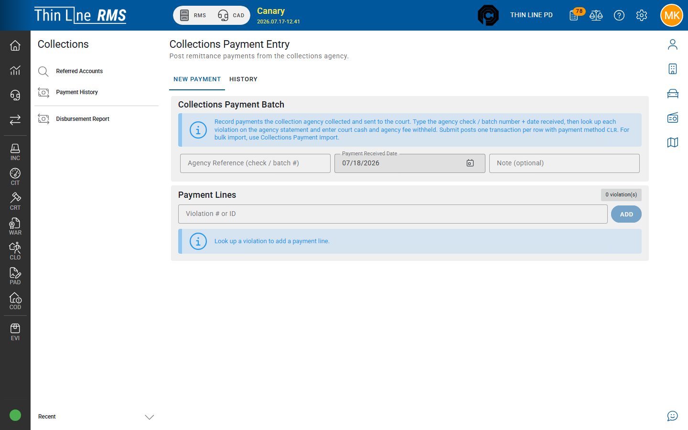

# Payment entry

Manually post a remittance received from the collections vendor (requires Collections **modify**).

## Steps

1. Open **Collections** → **Payment Entry**.
2. Enter **Agency Reference (check / batch #)**.
3. Enter **Payment Received Date**.
4. Optional note.
5. Look up **Violation # or ID** and add payment lines.
6. For each line, enter **Court cash** and **Agency fee withheld** (TPC) as the remittance specifies.
7. **Post Payments**.

Use the **New payment** / **History** tabs on the screen to switch between entry and recent entry history.

Posted remittances typically use a collections remittance method (court cash posts to GL; withheld fee clears the subledger per product rules).

## Tips

- Keep the vendor check/batch # in Agency Reference for audit.
- Do not also apply the same remittance through Court Apply Payment.
- For file-based remittances, prefer [Payment import](payment-import.md).

## Related

- [Payment import](payment-import.md)
- [Payment history](payment-history.md)
- [Disbursements](disbursements.md)
