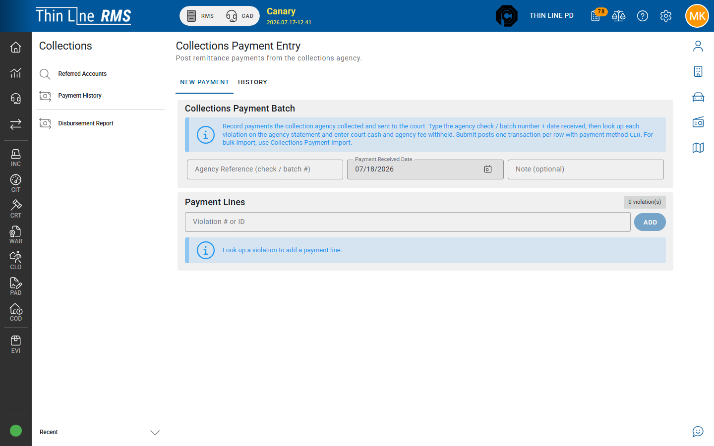

# Payment entry

Manually post a remittance received from the collections vendor (requires Collections **modify**).

## Steps

1. Open **Collections** → **Payment Entry**.
2. Enter **Agency Reference (check / batch #)**.
3. Enter **Payment Received Date**.
4. Optional note.
5. Look up **Violation # or ID** and add payment lines.
6. For each line, enter **Court cash** and **Agency fee withheld** (TPC) as the remittance specifies.
7. **Post Payments**.

Use the **New payment** / **History** tabs on the screen to switch between entry and recent entry history.

Posted remittances typically use a collections remittance method (court cash posts to GL; withheld fee clears the subledger per product rules).

You can post remittance on a referred case even when it is in an **FTA warrant** or **CPF warrant** state. Paying the referred balance in full does **not** automatically recall the warrant or move the case out of the warrant path — handle warrant recall separately if the court orders it.

## Court cash vs TPC

- **Court cash** cannot exceed the outstanding **non-TPC** (court / principal) balance on the remittance line. The UI caps the amount; posting more is rejected.
- Put the collections fee in **Agency fee withheld** (TPC) — do not put TPC dollars in court cash.
- Agency reference and remittance notes are saved trimmed and uppercase for consistency.

## Tips

- Keep the vendor check/batch # in Agency Reference for audit.
- Do not also apply the same remittance through Court Apply Payment.
- For file-based remittances, prefer [Payment import](payment-import.md).

## Related

- [Payment import](payment-import.md)
- [Payment history](payment-history.md)
- [Disbursements](disbursements.md)
