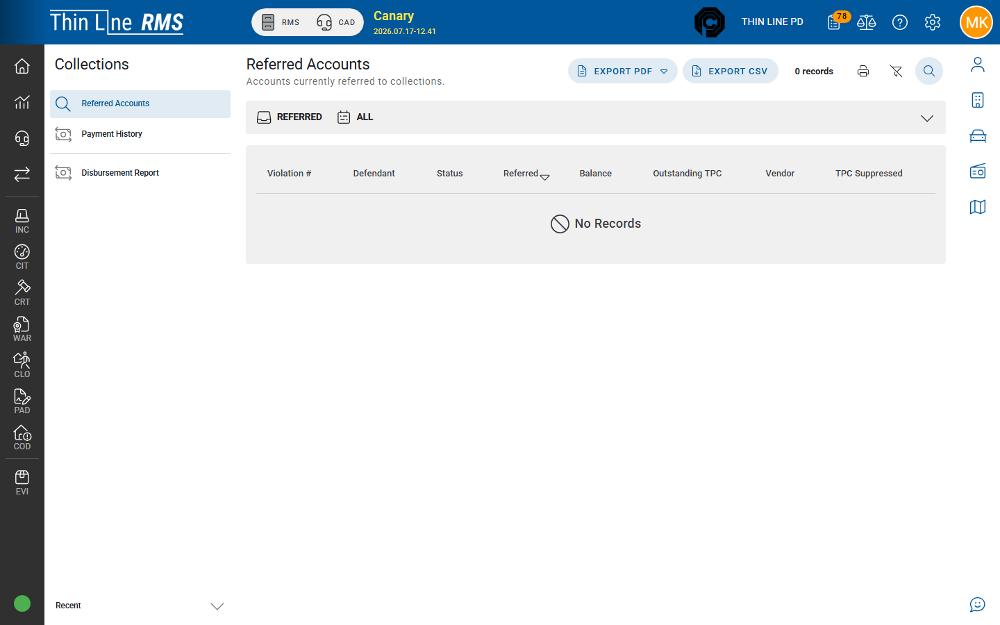

# Refer and recall

Move eligible court violations into (or out of) third-party collections from **Court**.

## When a case becomes eligible

Under Tex. Code Crim. Proc. Art. 103.0031, eligibility is based on a **source date** plus at least **60 days** (eligible on the **61st day** after that date), not on whether a CPF warrant exists.

| Case type | Source date |
|-----------|-------------|
| Unadjudicated (e.g. FTA / appearance path) | Required **appearance** date |
| Adjudicated / dismissal with money owed | **Compliance due** (paid-in-full) date — defaults to judgment + 5 business days; payment plans and community-service due dates can extend it |

Later-assessed fees can age on their own clock. Referring may place only the amounts that are already past their window; remaining principal can follow as additional referral items when eligible.

## Eligibility indicators

On the court violation **Collections** / **Third-Party Collections** card you typically see:

| Chip | Meaning |
|------|---------|
| **ELIGIBLE** | May be referred |
| **IN COLLECTIONS** | Already referred |
| **NOT ELIGIBLE** | Not referable under current rules |

The card also shows eligibility basis / source date when available. Common blockers: indigency rules that suppress TPC, principal/balance rules, unpaid TPC preventing a new TPC, missing appearance or compliance due dates — follow your court policy and on-screen warnings.

## Refer a case

1. Open the court violation.
2. Confirm **ELIGIBLE** (or your agency’s batch queue — **Collections — eligible** / CV|13).
3. Choose **Refer to collections** (add a note when prompted).
4. Confirm the case shows **IN COLLECTIONS**.
5. Find it under [Referred accounts](referred-accounts.md).

### Batch refer

Use Court work queues **Refer to Collections** / **Batch Refer to Collections** when referring many eligible cases at once.

After this release, membership in the eligible queue may change (appearance / compliance due instead of CPF warrant timing). Rebuild court violation health for the agency after deploy so health issues stay accurate.

## Recall a case

1. Open the violation that is **IN COLLECTIONS**.
2. Choose **Recall from collections**.
3. Confirm status updates and that portfolio filters no longer show it as active referred (or show **RECALLED**).

## Apply collections payment (Court)

Some builds offer **Apply collections payment** on the case. Prefer the Collections module [Payment entry](payment-entry.md) / [Payment import](payment-import.md) for vendor remittance so portfolio and disbursements stay consistent — follow your agency SOP if both exist.

## Admin setup (context)

Agency collections vendor name/contact and auto-refer days (minimum 60) are maintained with Thin Line / Admin during implementation — not every clerk should change them.

## Related

- [Referred accounts](referred-accounts.md)
- [Court — Work queues](../court/work-queues.md)
