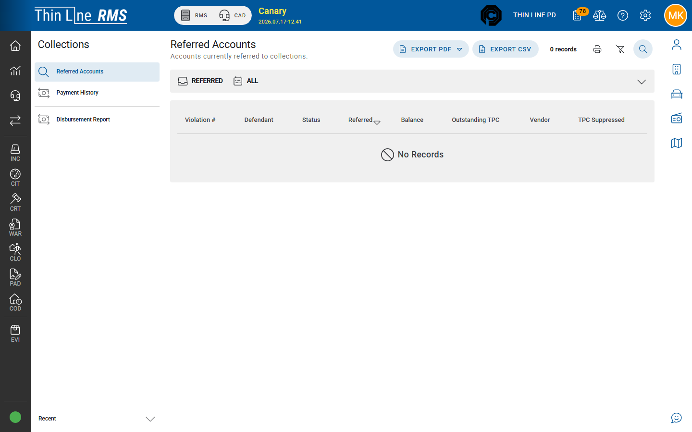

# Referred accounts

Browse the portfolio of accounts in collections.

## Open the portfolio

1. Open **Collections** → **Referred Accounts**.
2. Filter by status (**REFERRED** / **SATISFIED** / **RECALLED**), violation #, defendant, vendor, referred-on date.
3. Export **PDF** / **CSV** or print the grid when needed for vendor or finance review.

## Tips

- Referral happens in Court — see [Refer and recall](refer-and-recall.md).
- Satisfied / recalled rows are history; remittance posting targets active referred balances.

## Related

- [Payment entry](payment-entry.md)
- [Payment history](payment-history.md)
