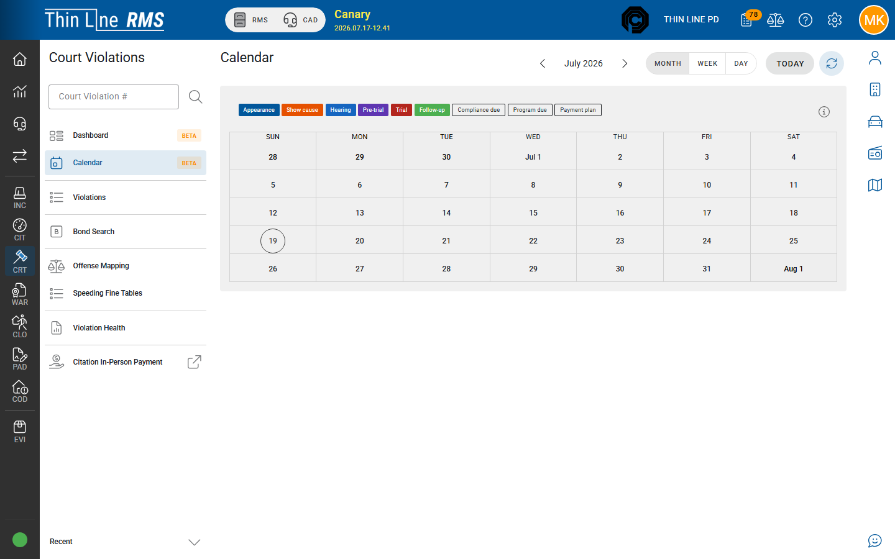

# Calendar and appearances

Scheduling appearances, show-cause hearings, pre-trial, and trial dates.

Step-by-step for a busy day: [Run a docket day](how-tos/run-a-docket-day.md).

## Calendar

Open **Calendar** in Court Violations to see scheduled court activity. Use it to plan a docket day, confirm who is set to appear, and jump into individual cases.

The **dashboard** also surfaces a day agenda so you can start from “today” without opening the full calendar first.

## Docket-day flow

1. Open **Calendar** (or today’s agenda on the dashboard).
2. Filter or focus on the session you are calling.
3. Open each case from the calendar entry.
4. Record the outcome (appearance, plea, continuance, FTA, etc.).
5. If the court continues the case, use a **modify date** action so the next setting appears on the calendar and in queues.

## Date types you will use

| Date / setting | Typical use |
|----------------|-------------|
| **Appearance date** | First or continued appearance (especially Pre-plea) |
| **Show-cause date** | Hearing after FTA or failed compliance / program |
| **Pre-trial date** | Not-guilty track before trial |
| **Trial date** | Bench or jury trial setting |
| **Follow-up date** | Soft reminder / follow-up not always tied to a state change |
| **Compliance due date** | Post-judgment or program compliance deadline |

Exact fields appear in state actions and dialogs. **Enter follow-up date** is commonly available across states as a scheduling aid.

## Change a date without changing the path

Many states allow a “modify date only” action, for example:

- Modify appearance date (stay in Pre-plea)
- Modify show-cause date (stay on FTA or FTC track)
- Modify pre-trial or trial date
- Modify compliance due date

Use these when the court continues a setting but the procedural path has not changed.

## Show cause

Show-cause dates are central after missed appearances or failed compliance. Setting or updating the show-cause date is often required before certain enforcement actions. Show-cause information also appears on some court documents and reports.

## Tips

- After you schedule, confirm the case still appears where you expect (calendar + relevant work queue).
- Batch tools may exist for setting show-cause dates across multiple cases — use carefully and verify a sample.
- Time zones follow agency settings; confirm compliance due dates if your court spans unusual hours or DST changes.

## Related

- [How-to: Run a docket day](how-tos/run-a-docket-day.md)
- [Getting around](getting-around.md)
- [FTA, warrants, and bonds](fta-warrants-bonds.md)
- [Court programs](court-programs.md)
