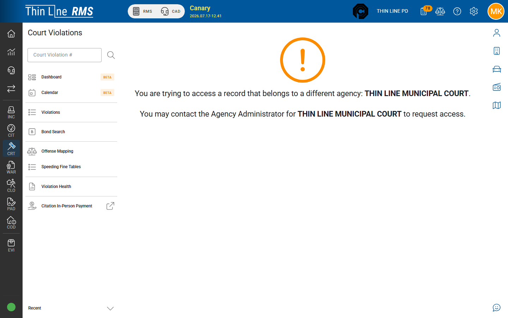

# Court programs

Deferred disposition and related diversion-style **court programs**.

Step-by-step: [Grant a court program](how-tos/grant-a-court-program.md).

## What a court program is

A **court program** is a supervised compliance path granted instead of (or before) a final conviction outcome. In the product UI you may see actions such as **Grant court program** or **Grant deferred disposition**, depending on wording in your build. Conditions, due dates, and completion rules drive whether the case can close successfully.

Older materials may say “deferred disposition” or “diversion.” Prefer the labels shown in your Thin Line screens.

## Grant a program

Typical path:

1. Case is in **Post-plea, pre-judgment** (after a guilty / no contest style plea path).
2. Choose **Grant court program** (or equivalent).
3. Set program conditions, attorney information if used, and dates.
4. Case moves to the **Court program** procedural state.

While the program is active, use **View/modify court program** to update conditions without changing state when you only need to edit the plan.

## Successful completion

When the defendant meets program requirements:

- Use the complete-program action that **dismisses** (or otherwise closes per the dialog).
- Confirm documents and fees match your court’s practice.

Completed programs often end in **Dismissed**.

## Failure and show cause

If the defendant does not comply:

1. **Mark court program as failed** (or equivalent) — typically sets a show-cause path.
2. Case moves to a **failed to comply** program state.
3. At show cause, record appearance and return to post-plea, reschedule show cause, move to FTA if they miss again, or revoke the program.

## Revoke without the full FTC path

**Revoke court program** returns the case toward **Post-plea, pre-judgment** when the program should end without completing the failure-to-comply show-cause sequence. Use the path that matches the court’s order.

## Tips

- Watch the **Program / compliance** work queues for missed deadlines and cases ready to close.
- Keep condition due dates accurate — queues and health checks use them.
- Payment plans and program conditions are related but separate; clear both when closing.

## Related

- [How-to: Grant a court program](how-tos/grant-a-court-program.md)
- [Pleas and judgment](pleas-and-judgment.md)
- [Calendar and appearances](calendar-and-appearances.md)
- [Work queues](work-queues.md)
