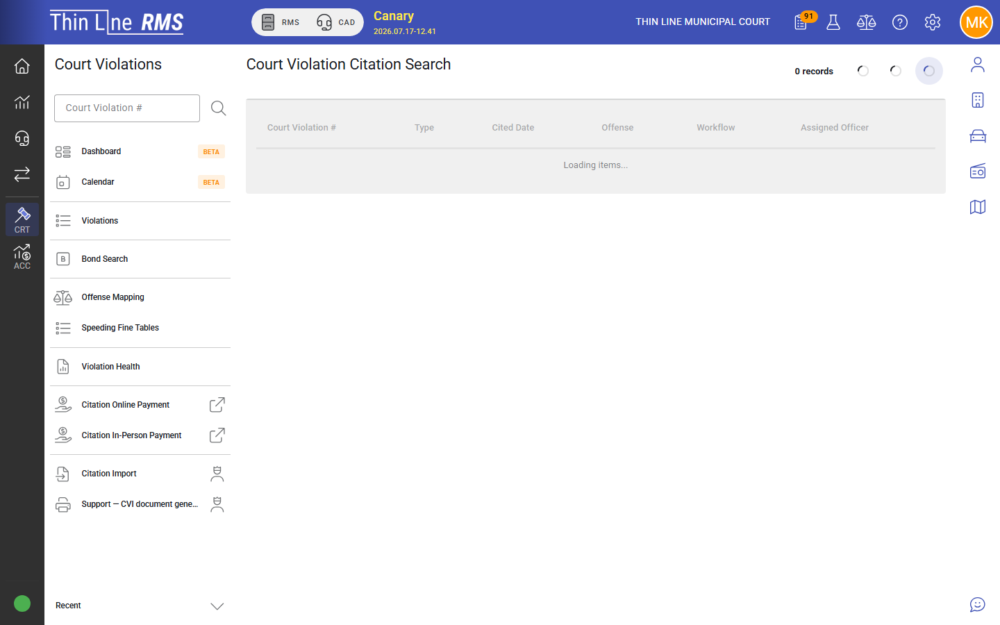
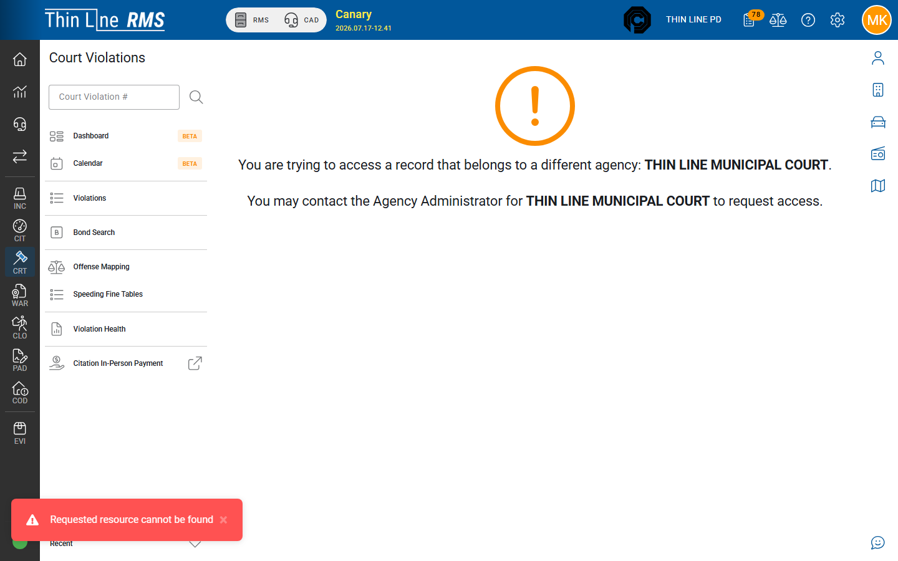
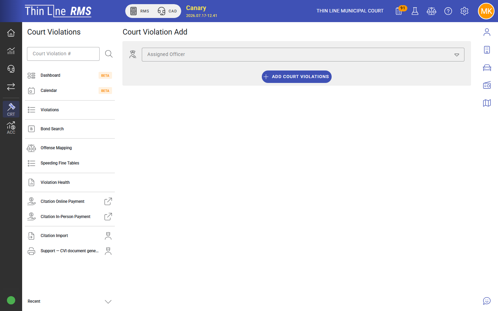

# Create and import cases

How court violations enter the system and become active court work.

## How cases usually start

Most court violations are created from a **citation** issued in the field or entered in RMS. One citation can produce one or more court violations (for example multiple offenses).

Typical path:

1. Citation exists in Thin Line (or is imported) — see [Citation to court](../rms/citations/citation-to-court.md).
2. Court violation record(s) are created for the court agency.
3. Clerk reviews the new case and **activates** it into the active court flow (commonly moving from **New** to **Pre-plea** with a first appearance date).

Step-by-step for clerks: [Activate a new case](how-tos/activate-a-new-case.md).

## New Case Review

New cases often appear in a **New Case Review** work queue (and as **New** on search).

Use that queue to:

1. Open the case and confirm defendant, offense, and citation link.
2. Set or confirm the first **appearance** date (and time if your court uses it).
3. Run **Activate** (or the equivalent) to move the case to **Pre-plea**.
4. Transfer or void when the case should not proceed in your court.

Do not leave large backlogs in New without a plan — activated cases are what appear on the active docket and calendar workflows.

## Add a court violation

When your role allows it, you can **add** a court violation manually from Court Violations → **Add**.

Use this when a case must be entered without the usual citation path. Typical fields to complete:

| Area | What to enter |
|------|----------------|
| Defendant | Search/select the master person (prefer existing masters) |
| Offense | Court-mapped offense |
| Citation / case numbers | Per agency numbering rules |
| Appearance | First setting if known |
| Agency / court | Confirm you are in the correct court agency |

Follow your agency’s policy for when manual add is allowed versus citation import.

## Import

Agencies that receive batches of court cases (for example during conversion or bulk intake) may use Court Violations → **Import**. File formats and column mappings are agency-specific; coordinate with Thin Line during onboarding or conversion. After import, work the same **New Case Review** steps as for citation-created cases.

## After create / activate

Once a case is active:

- It can appear on the **calendar** when dates are set
- Clerks can take **plea and scheduling** actions from the case
- Payments, bonds, and programs become available according to state rules

## Related

- [How-to: Activate a new case](how-tos/activate-a-new-case.md)
- [Citation to court](../rms/citations/citation-to-court.md)
- [Getting around](getting-around.md)
- [Case lifecycle](case-lifecycle.md)
- [Calendar and appearances](calendar-and-appearances.md)
- [Work queues](work-queues.md)
