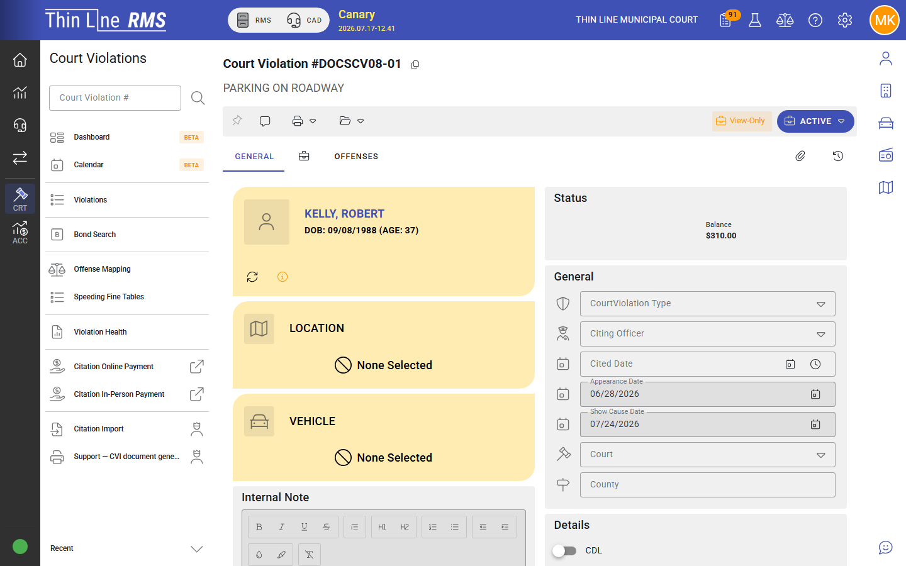
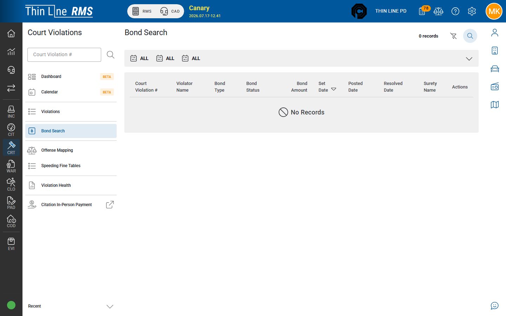

# FTA, warrants, and bonds

Failure to appear, warrant-related paths, and bond handling on court violations.

Step-by-step: [Handle FTA and court warrant](how-tos/handle-fta-and-court-warrant.md).

## Failure to appear (FTA)

When a defendant misses a required appearance:

1. Open the court violation (often from the calendar or an FTA queue).
2. Choose **Mark failure to appear** (or the equivalent enabled action).
3. Set or confirm **show-cause** information when prompted.
4. The case moves onto the **FTA** track (workflow often treats this as an inactive / enforcement bucket until resolved).

From FTA, common next steps include issuing an **FTA warrant**, scheduling or updating show cause, or returning the case when the defendant appears / bond is resolved — according to the actions enabled for that state.

## Warrants

Court Violations coordinates with the **[Warrants](../rms/warrants/README.md)** module for FTA and related enforcement.

Typical clerk path:

1. From the FTA case (often **FTA — Missed Show Cause**), use **Issue Warrants**. **Issue Warrants** is disabled when the defendant was under 17 at the offense (those cases also stay off the warrant-issuance work queues).
2. Confirm the warrant number and court-owned fields on the warrant record. An **e-signed arrest warrant PDF** is attached to the warrant automatically (CPF paths attach the **Capias Pro Fine** warrant PDF).
3. Law enforcement works service from the Warrants module — see [Court-owned FTA and CPF](../rms/warrants/court-owned-fta-cpf.md).

FTA **show-cause notices** and **address labels** print from **FTA — Missed Appearance** batch print (set show-cause dates first). Case-level affidavits and related forms are on the case Documents grid — see [Documents and forms](documents.md).

Post-judgment non-compliance may follow a **CPF** (capias pro fine) track, including CPF warrant and CPF failed-to-comply states. Treat those as enforcement paths after conviction / compliance failure, not as a first-appearance FTA.

Cross-agency handoff: [Journey — Court warrant to LE service](../getting-started/journeys/court-warrant-to-le-service.md).

## Bonds

Bond actions are available on most active states (typically not on brand-new unactivated cases):

| Action | Purpose |
|--------|---------|
| **Enter bond** | Record a new bond on the case |
| **Modify bond** | Update an existing bond |
| **Resolve bond** | Close out the bond per court outcome |

Use **Bond search** (Court Violations → Search bonds) when you need to find bonds across cases. Surety bond show-cause work often appears in a dedicated work queue; that queue can **batch print** the bond-company show-cause letter and the violator show-cause letter. Bond search (and work queues) can optionally **highlight rows** while you scan a long list.

When you enter or resolve a bond that has a **surety person**, that person is used as the **default depositor** — change it only when the deposit belongs to someone else.

Bond rules can **block** other transitions until the bond situation is consistent with the next court action. If a plea or disposition action is disabled, check for an outstanding bond requirement.

## Returning from FTA

Typical resolution patterns (availability depends on state):

- Defendant appears at show cause → record appearance and return to the appropriate pre-plea / post-plea state
- Bond hearing / bond posted → use bond actions and enabled FTA-resolution actions
- Warrant recalled / case resumed → follow the enabled transition and update dates

## Related

- [How-to: Handle FTA and court warrant](how-tos/handle-fta-and-court-warrant.md)
- [Warrants](../rms/warrants/README.md)
- [Journey — Court warrant to LE service](../getting-started/journeys/court-warrant-to-le-service.md)
- [Working across agencies](../getting-started/working-across-agencies.md)
- [Case lifecycle](case-lifecycle.md)
- [Calendar and appearances](calendar-and-appearances.md)
- [Work queues](work-queues.md)
- [Documents and forms](documents.md)
