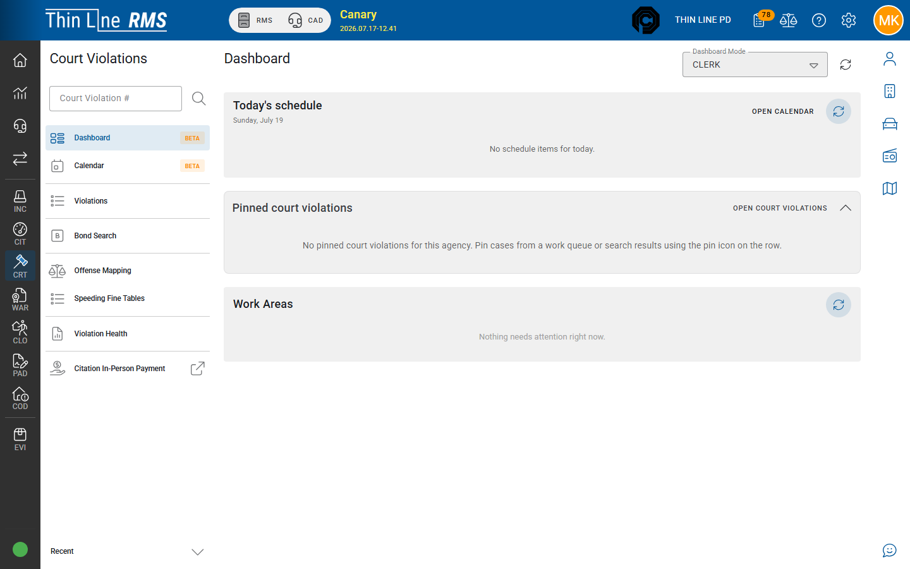

# Court how-tos

Step-by-step clerk tasks for day-one Court Violations work. Use these during onboarding and the [Court clerk workshop](../../training/court-clerk-workshop.md). For concepts and state rules, use the [Court topic guides](../README.md).

## How-tos in this pack

| How-to | Goal |
|--------|------|
| [Activate a new case](activate-a-new-case.md) | Move a case from New → Pre-plea with an appearance date |
| [Run a docket day](run-a-docket-day.md) | Work today’s calendar and record outcomes |
| [Record a plea and judgment](record-a-plea-and-judgment.md) | Enter plea, then judgment (or hand off to a program) |
| [Grant a court program](grant-a-court-program.md) | Grant deferred / diversion-style compliance |
| [Take and accept a payment](take-and-accept-a-payment.md) | Apply a payment and accept it for final receipt |
| [Set up a payment plan](set-up-a-payment-plan.md) | Create an installment plan and verify it on the case |
| [Handle FTA and court warrant](handle-fta-and-court-warrant.md) | Mark FTA, set show cause, coordinate warrant / bond |
| [Work your queues](work-your-queues.md) | Clear the highest-priority work queues in order |

## Suggested practice order

1. Activate a new case  
2. Run a docket day  
3. Record a plea and judgment **or** grant a court program  
4. Take and accept a payment  
5. Set up a payment plan (when your scenario has a balance after judgment)  
6. Handle FTA and court warrant  
7. Work your queues  

## Related

- [Court](../README.md)
- [Court clerk workshop](../../training/court-clerk-workshop.md)
- [Citation to court](../../rms/citations/citation-to-court.md)
