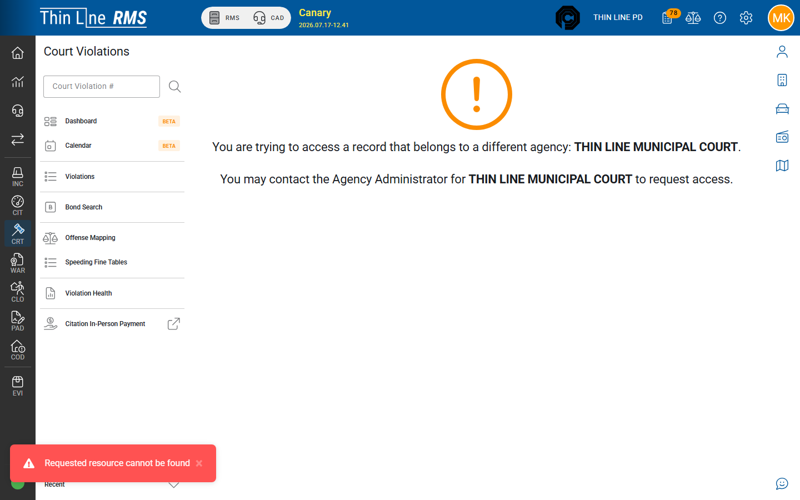
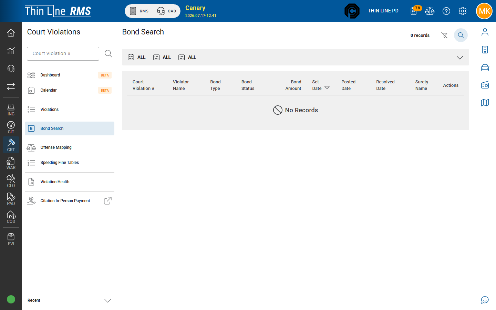

# Handle FTA and court warrant

## Goal

Mark failure to appear, set show cause, and start the warrant / bond path your court uses for enforcement.

## Prerequisites

- Case that missed a required appearance
- Modify rights; warrant claims as required by your agency
- Understanding of whether LE or court staff issues the warrant in your process

## Steps — FTA

1. Open the case from the **calendar**, search, or an FTA work queue.
2. Choose **Mark failure to appear** (or the equivalent enabled action).
3. Set or confirm the **show-cause** date when prompted.
4. Confirm the case is on the **FTA** track and appears in the FTA / show-cause queue.

## Steps — warrant and bond

1. From the FTA case, use the enabled **issue / update warrant** action when your court issues from Court.
2. Confirm court-owned warrant fields; LE works service in [Warrants](../../rms/warrants/README.md) — see [Court-owned FTA and CPF](../../rms/warrants/court-owned-fta-cpf.md).
3. If bond is ordered, use **Enter bond** / **Modify bond** on the case, or find the bond under **Bond search**.

4. When the defendant appears or bond is resolved, use the enabled return-from-FTA / resolve-bond actions and update dates.

## Expected result

- Case is on FTA (not stuck on an old appearance date).
- Show-cause date is set when required.
- Warrant and bond work are visible to the teams that must act next.

## Related

- [FTA, warrants, and bonds](../fta-warrants-bonds.md)
- [Journey: Court warrant to LE service](../../getting-started/journeys/court-warrant-to-le-service.md)
- [Working across agencies](../../getting-started/working-across-agencies.md)
- [Calendar and appearances](../calendar-and-appearances.md)
