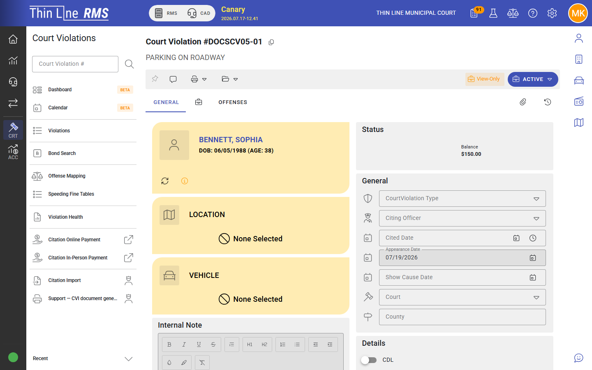

# Record a plea and judgment

## Goal

Enter a plea on a Pre-plea case, then enter judgment when the court convicts (or hand off to a court program instead).

## Prerequisites

- Case in **Pre-plea** (activated) — Violations search shows **PRE-PLEA** on the row state control
- Modify rights on Court Violations
- Court order / judge direction for the plea and disposition

## Steps — plea

<!-- scenario: court-preplea-enter-plea-nco -->

1. Open the court violation (or open the **PRE-PLEA** state menu on Violations search).
2. Choose **Enter plea** (or **Change plea** if a plea already exists).
3. Select the plea:
   - **Guilty** or **No contest** → typically post-plea, pre-judgment
   - **Not guilty** → typically pre-trial (set pre-trial / trial dates as prompted)
4. Complete any required appearance or scheduling fields in the dialog.
5. Save / confirm.

<!-- scenario: court-preplea-enter-plea-cancel -->
If you open **Enter plea** by mistake, choose **Cancel** — the case stays in Pre-plea and no plea is stored.

## Steps — judgment

When the court enters judgment (after guilty / no contest, or after a guilty verdict):

1. Open the case.
2. Choose **Enter judgment**.
3. Complete judgment details required by the dialog (fines, costs, compliance as applicable).
4. Confirm the case moves to **Convicted** (or your court’s post-judgment state).

If the court grants deferred disposition / a program instead of judgment, stop here and follow [Grant a court program](grant-a-court-program.md).

## Expected result

- Plea is stored on the case.
- After judgment, the case is **Convicted** and ready for payments, plans, or compliance work.

## Related

- [Pleas and judgment](../pleas-and-judgment.md)
- [Case lifecycle](../case-lifecycle.md)
- [How-to: Grant a court program](grant-a-court-program.md)
- [How-to: Take and accept a payment](take-and-accept-a-payment.md)
