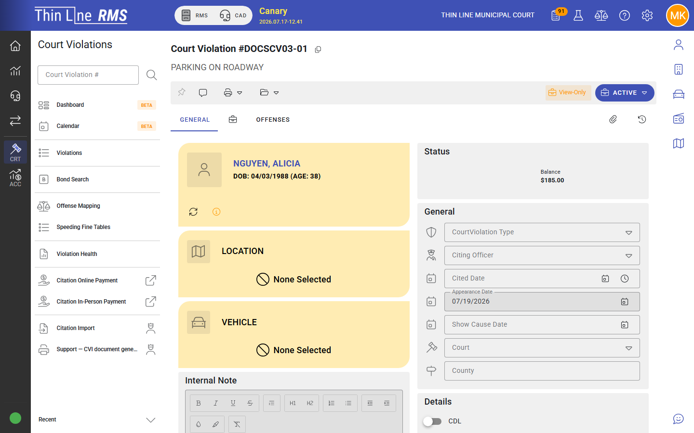

# Take and accept a payment

## Goal

Record an external / off-platform payment on a court violation, then accept it so the final receipt is complete.

## Prerequisites

- Case with an open balance
- Access to **Apply Payment/Credit** on Accounting (Thin Line full support on current builds); acceptance rights per agency practice
- Correct court agency selected

## Steps — apply

1. Open **Court Violations** and find the case (search by violation number or defendant).
2. Confirm the **balance**.
3. Open **Accounting** and choose **Apply Payment/Credit**.
4. Confirm the notice that this updates the case balance only (no general ledger / deposit batch posting).
5. Enter amount, payment method, and date.
6. Submit. Note that the payment is **pending** until accepted (queue: **Payment - Accept New**).

## Steps — accept

1. Open **Work queues**.
2. Open **Payment — accept new** (or the pending-payment queue name in your build).
3. Open the payment / case row.
4. Review amount and method.
5. **Accept** the payment (or follow reject / correct if something is wrong).
6. Print or provide the **final receipt** after acceptance.

## Expected result

- Payment is accepted (not left pending).
- Case **balance** updates.
- External Apply Payment does **not** create general ledger / deposit batch work — see [From Court payments](../../accounting/from-court-payments.md).

## Related

- [Payments](../payments.md)
- [Journey: Court payment to accounting](../../getting-started/journeys/court-payment-to-accounting.md)
- [How-to: Set up a payment plan](set-up-a-payment-plan.md)
- [How-to: Work your queues](work-your-queues.md)
