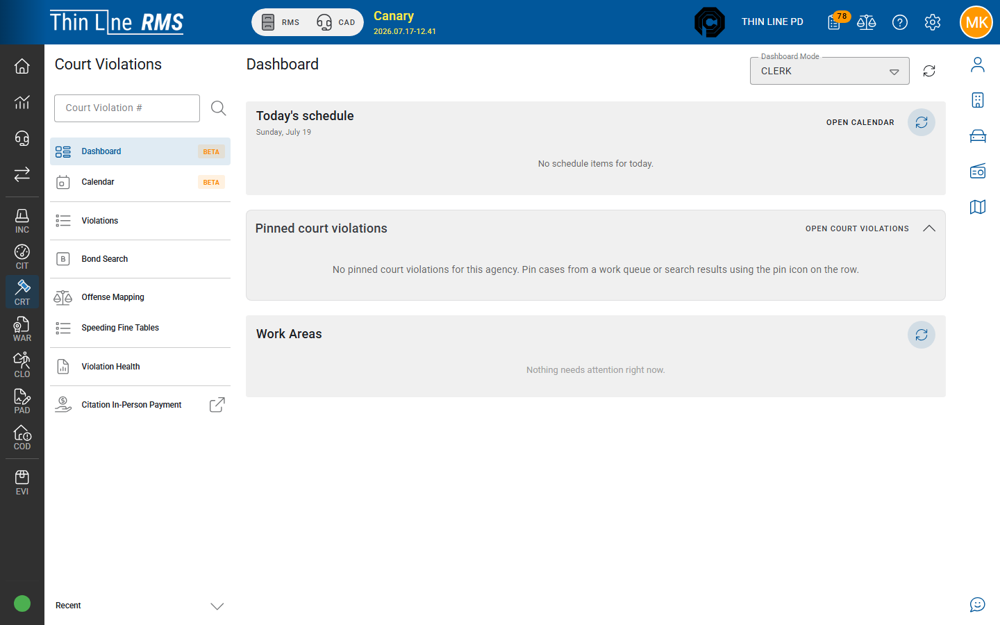

# Work your queues

## Goal

Clear the highest-priority Court work queues in a sensible daily order so intake, money, and enforcement stay current.

## Prerequisites

- Court Violations access
- Familiarity with what each queue means — see [Work queues](../work-queues.md)

## Steps

1. Open **Court Violations** → **Work queues** (or start from dashboard queue counts).
2. Work queues in this order unless your court administrator sets a different priority:

| Order | Queue (typical) | What to do |
|------:|-----------------|------------|
| 1 | **Payment — accept new** | Accept or correct pending payments — [Take and accept a payment](take-and-accept-a-payment.md) |
| 2 | **New case review** | Activate or transfer/void — [Activate a new case](activate-a-new-case.md) |
| 3 | **FTA / show cause** | Show cause, warrant, bond, or return — [Handle FTA and court warrant](handle-fta-and-court-warrant.md) |
| 4 | **Missed payment / compliance** | Notices, show cause, accept payments |
| 5 | Program / collections / follow-up | Per court priority |

3. For each row: open the case, take the state action (not only an edit dialog), and confirm the case leaves the queue or moves to the correct next queue.
4. Use batch actions only when you understand the effect; spot-check a few results.

## Expected result

- Pending payments are not aging overnight.
- New cases are activated onto the docket.
- Enforcement and compliance queues shrink to true exceptions.

## Related

- [Work queues](../work-queues.md)
- [Getting around](../getting-around.md)
- [Court clerk workshop](../../training/court-clerk-workshop.md)
