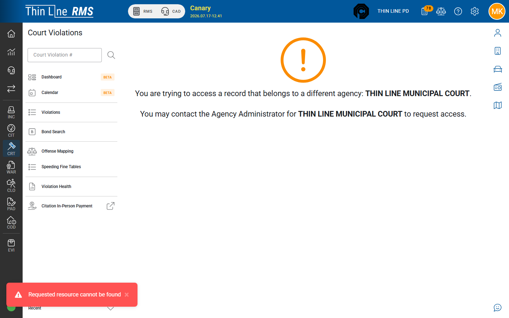

# Payment plans

Installment plans for court violation balances.

Step-by-step: [Set up a payment plan](how-tos/set-up-a-payment-plan.md).

## When to use a payment plan

After judgment (typically in **Convicted**), when the court allows the defendant to pay over time instead of paying in full immediately. Some courts also allow plans earlier — follow local policy and the actions enabled on the case.

## Create or view a plan

1. Open the court violation.
2. Choose **Create payment plan** or **View payment plan**.
3. Enter installment schedule, amounts, and required fees per the dialog and your court policy.
4. Save. The case often emphasizes a **Compliance** workflow bucket while a plan is active.

Indicators on search results help you see which cases already have an active payment plan.

## Missed installments

When an installment is missed:

- Cases appear in **missed payment / compliance** work queues.
- Follow your court’s notice process (including late notice documents when configured).
- Use **Mark failed to comply** / show-cause actions when enforcement is required — wording in the UI may say **Mark failed to comply** rather than older “schedule show cause” language.

## Time-payment fee

Some agencies assess a time-payment (or similar) fee for installment plans. A dedicated **payment plan fee** queue helps clerks find cases eligible for that assessment. Follow your court’s fee schedule and local rules.

## Cancel or change a plan

- View the active plan and historical plans from the payment plan dialog.
- Cancel a plan when the court voids the arrangement or the case disposition changes (for example dismissal paths that require plan cleanup).
- Do not leave active plans on disposed cases — health checks flag these situations.

## Closing cases with plans

Before considering a case complete:

- Confirm the balance and plan status
- Complete or cancel the plan appropriately
- Accept any pending payments
- Confirm procedural state and workflow status match a closed outcome

## Related

- [How-to: Set up a payment plan](how-tos/set-up-a-payment-plan.md)
- [Payments](payments.md)
- [Work queues](work-queues.md)
- [Pleas and judgment](pleas-and-judgment.md)
