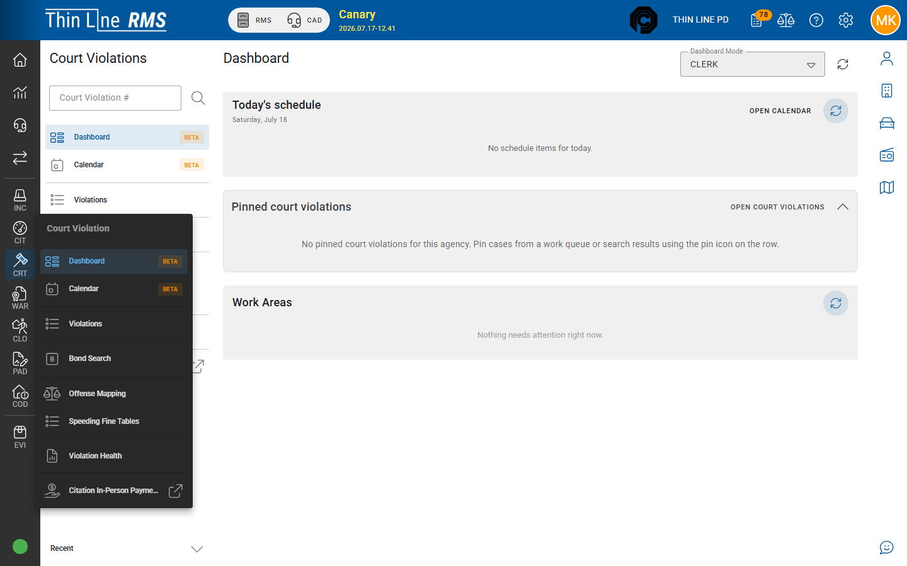

# Reports

Court **regulatory reporting packs** (OCA, DPS, State Quarterly) and how they relate to day-to-day prints.

For the full list of case PDFs (notices, judgments, warrants, program letters, labels) and **where each is printed**, see [Documents and forms](documents.md).

## Operational prints (summary)

Clerks print case documents from the **case utility drawer**, **work-queue batch print**, or automatic attachments. Common groups:

- Court violation overview / statement
- Notices (initial setting, pre-trial, show cause, late notice, missed-deadline show cause)
- Deferred disposition / court program, teen court, DSC, and installment agreement documents
- Receipts (final receipts after payment acceptance) — see [Payments](payments.md)
- Citation copies from a court violation (including **batch** citation detail prints from New Case Review)
- FTA / compliance **address labels** from work-queue batch print (not from the case Documents grid)

Use the document your court adopted in training; templates can vary by agency configuration.

## Regulatory / state packs

Thin Line includes Texas-oriented reporting packs for municipal court operations. Availability depends on your agency setup and permissions.

| Report pack | Typical purpose |
|-------------|-----------------|
| **OCA** | Office of Court Administration style monthly court activity reporting |
| **DPS conviction** | Conviction reporting to DPS |
| **State quarterly** | Quarterly state accounting / fee reporting |

These reports are for authorized court staff. Many packs are also launched from left-rail [Import/Export](../import-export/README.md) (**DPS Conviction**, **OCA**, **State Quarterly**). Agree one path per filing so staff do not produce conflicting files. Agency identifiers are configured during implementation.

## Analytics

Some environments include **court violation analytics** for volume and workload views. Treat analytics as operational insight, not a substitute for required state filings.

## Tips

- Run a sample period in a non-production or carefully reviewed run before the first live filing deadline after go-live.
- If totals look wrong, verify payment **acceptance**, dismissed/voided cases, and date filters before assuming a report defect.
- Online payment URL and related fields may appear on defendant-facing notices when configured.

## Related

- [Documents and forms](documents.md)
- [Import/Export](../import-export/README.md)
- [Payments](payments.md)
- [Work queues](work-queues.md)
- [Court overview](README.md)
