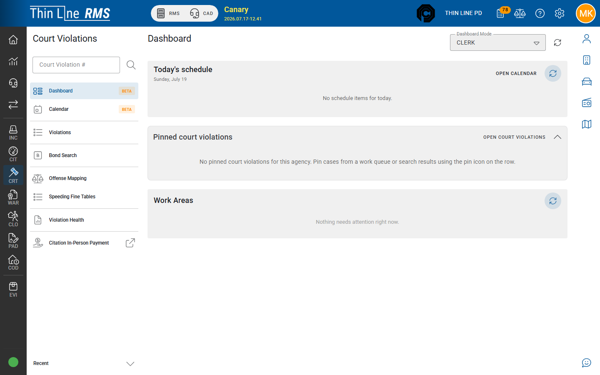

# Work queues

Exception-driven lists of court violations that need clerk or judge attention.

Step-by-step: [Work your queues](how-tos/work-your-queues.md).

## Why use queues

Search is for finding a known case. **Work queues** answer: “What should we work next?” Counts on the dashboard help you prioritize the day.

In navigation you may see **Work Queues** (older builds may have said Court Proceedings).

## Day-one triage (recommended order)

For a typical clerk morning, clear in this order unless your court administrator sets a different priority:

1. **Payment — accept new** — so receipts and deposits stay current
2. **New case review** — activate today’s intake so cases hit the docket
3. **FTA / show cause** — enforcement and bond work
4. **Missed payment / compliance** — notices and show-cause
5. Everything else (program queues, collections eligible, follow-ups)

## Common queues

Names in your environment may vary slightly; these are the usual work areas:

| Queue (typical) | What it usually means | Typical next step |
|-----------------|----------------------|-------------------|
| **New case review** | Newly created cases not yet activated | Set appearance; activate to Pre-plea; transfer/void if needed |
| **FTA — missed appearance / show cause** | Failure to appear work | Set show cause; warrant/bond path; record appearance |
| **Program Failures — Show Cause Required** | Pre-judgment court program failed or past due (balance / unmet conditions) | Issue show cause before judgment; notice or fail/revoke per court order |
| **Program Show Cause — Court Action Required** | Program show-cause hearing passed or unresolved | Record appearance or judicial disposition |
| **Surety bond — show cause** | Bond-related show cause | Bond hearing / resolve bond actions |
| **Program — ready to close** | Program appears complete | Verify conditions; complete program / dismiss |
| **Follow-up — past due** | Follow-up date passed | Contact, reschedule, or clear follow-up |
| **Compliance — missed payment** | Installment or payment compliance missed | Notice; Failure to Comply / show cause; accept payments |
| **Payment plan — fee eligible** | Time-payment fee assessment candidate | Assess fee per policy |
| **Collections — eligible** | Past the statutory collections window (appearance or compliance / paid-in-full due + 60 days) with a balance, not yet referred | Refer per agency process (see [Collections](../collections/README.md) / [Refer and recall](../collections/refer-and-recall.md)) |
| **Payment — accept new** | Payments awaiting court acceptance | Accept (or correct) pending payments |

## How to work a queue

1. Open **Work queues** from Court Violations.
2. Select a queue and review the list.
3. Open a case, take the appropriate action, and confirm it leaves the queue (or moves to the correct next queue).
4. Use batch actions only when you understand the effect (for example batch activate, batch show-cause date, or batch print). Spot-check results.

### Batch print (when the queue supports it)

From the batch actions menu you can print notices and related documents for the current result set. Queue-to-form mapping:

| Queue | Batch print |
|-------|-------------|
| **New Case Review** | Envelopes, judgments, in-person plea form, citation details (full) |
| **FTA — Missed Appearance** | Show Cause notice, address labels |
| **Program Failures — Show Cause Required** (and related program missed-deadline queues) | Missed Deadline Show Cause (deferred, DSC, or generic program letter from past-due conditions), address labels |
| **Compliance — Missed Deadline** | Show Cause Capias Pro Fine, address labels |
| **Compliance — Missed Payment** | Show Cause Capias Pro Fine, late notice letter, address labels |
| **Surety Bond — Show Cause** | Bond company show cause, violator show cause |

FTA / CPF **show-cause** queues issue **electronic warrants** instead of batch-printing warrant paper. The warrant PDF attaches on the warrant when you **Issue Warrants**. Cases where the defendant was **under 17 at the offense** (or is flagged juvenile) do not appear in those warrant-issuance queues, and **Issue Warrants** is disabled.

Many mark / print actions stay disabled until every row on the current page has a show-cause date set.

Full catalog: [Documents and forms](documents.md).

## Tips

- Clear **payment acceptance** daily so receipts and deposits stay current.
- Do not ignore **ready to close** and **health** signals — they prevent stuck balances, open plans on disposed cases, paid post-plea cases that still need judgment or disposition, and Closed cases that somehow still owe money.
- On **Court Violation Health** search, use **Ignore closed with zero balance** when you want to hide clean Closed cases and focus on open problems (including Closed cases that still show a balance).
- Use optional **row highlight** on work queues when scanning dense result lists.
- Work queues can **keep selected items** when you refresh or navigate away and return.
- When your agency uses **OmniBase**, open the **OmniBase** tab in the work queue utility drawer to review submissions and hold status.
- If a case will not leave a queue after you act, the action may have been dialog-only (edit without state change) or a guard blocked the transition.

## Related

- [How-to: Work your queues](how-tos/work-your-queues.md)
- [Getting around](getting-around.md)
- [Create and import cases](create-and-import.md)
- [Payments](payments.md)
- [FTA, warrants, and bonds](fta-warrants-bonds.md)
- [Documents and forms](documents.md)
