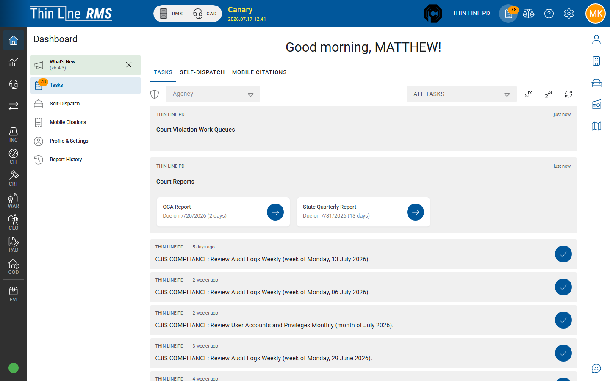

# Dashboard

Your home base after login: tasks, optional self-dispatch and mobile citations, profile, and report history.

## Open the Dashboard

1. Sign in (or choose **Dashboard** from the left module rail).
2. Confirm the **agency** in the header.
3. Use the **Dashboard** menu (next to the rail) for Tasks, What’s New, and other destinations.

Bookmark your agency URL ending in `/dashboard` (or the landing page Thin Line gave you) — not a stale login-only link.

## Dashboard menu

| Destination | Purpose | Who typically sees it |
|-------------|---------|------------------------|
| **What's New** | Release notes for the current product version | Until you hide it for this version |
| **Tasks** | Work assigned to you / your queues (badge shows count) | Everyone with Dashboard access |
| **Self-Dispatch** | Officer-initiated CAD from the Dashboard | When CAD mobile + self-dispatch are enabled for you |
| **Mobile Citations** | Write citations from the Dashboard | When mobile citations are enabled and you can modify citations |
| **Profile & Settings** | Your name, photo, password, personal preferences | Everyone |
| **Report History** | Reports you (and sometimes others) previously ran | Everyone with report history access |

Charts under Dashboard are not in the live agency menu (use [Analytics](../analytics/README.md) instead).

## Tasks

**Tasks** is the default Dashboard home.

1. Open **Dashboard** → **Tasks** (or the Tasks tab on the home page).
2. Optionally filter by **agency** (if you can access more than one) and task filter type.
3. Expand a task / queue group and open the item that needs work.
4. Use **Refresh** after you complete work so counts update.
5. When the list is empty, the Dashboard shows that you are caught up.

What appears depends on your **roles, claims, and agency notification settings** ([Admin — Agency settings](../admin/agency-settings.md)). Two people at the same agency can see different task groups.

Tasks send you into the owning module (incidents awaiting approval, court work, and similar). They do not replace module Search for finding arbitrary records.

## What's New

1. Open **What's New** when it appears (often highlighted after an upgrade).
2. Read the release notes for the version shown.
3. You can **hide** What’s New until the next version — it returns after the next upgrade.

Also available from header **Help** → Release Notes in many builds.

## Self-Dispatch and Mobile Citations

| Path | Guide |
|------|-------|
| Dashboard → **Self-Dispatch** | [CAD — Self-dispatch](../cad/self-dispatch.md) · [CAD workshop](../training/cad-workshop.md) |
| Dashboard → **Mobile Citations** | [Citations — Mobile citations](../rms/citations/mobile-citations/README.md) |

These appear as Dashboard menu items and as tabs on the Dashboard home when enabled. If missing, you lack claims or the agency has not enabled that mobile path.

## Profile & Settings

1. Open **Dashboard** → **Profile & Settings** (also reachable from the user avatar menu in many builds).
2. Review your display name and username.
3. Change password when your agency policy requires it.
4. Update photo / preferences only if your build offers those controls.

Agency-wide settings live under [Admin](../admin/README.md), not Profile.

## Report History

1. Open **Dashboard** → **Report History**.
2. Search by date, report type, or other filters shown.
3. Open or re-download a past report when your retention window still includes it.

Reports are commonly retained for a long period (often up to three years). Users with elevated report claims may see other users’ report history — see [FAQ](../support/faq.md).

For new statutory / transmission exports, start in [Import/Export](../import-export/README.md) or the module’s Reports menu, then return here to find prior runs.

## Dashboard vs other “dashboards”

| Surface | What it is |
|---------|------------|
| Left-rail **Dashboard** (this page) | Personal tasks, profile, report history, mobile shortcuts |
| **Court** module dashboard | Court clerk work-by-area / agenda — see [Court — Getting around](../court/getting-around.md) |
| **Accounting** dashboard | Finance close-out — see [Accounting](../accounting/README.md) |
| Support-only command centers | Not agency training topics |

## Related

- [Application shell](application-shell.md)
- [Journeys](journeys/README.md)
- [CAD — Self-dispatch](../cad/self-dispatch.md)
- [Support — FAQ](../support/faq.md)
