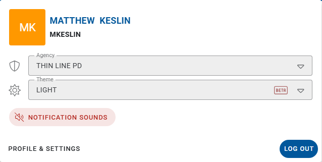

# Header and user menu

Agency context, Help, Admin, and account actions in the top header bar.

## Left side of the header

| Control | Purpose |
|---------|---------|
| **Hamburger** | Collapse or expand the left module rail |
| **Product logo** | Shows whether you are in the RMS or CAD branded shell |
| **RMS / CAD / JAIL** | Switch product mode (only modes you can access) |
| **Environment banner** | On non-production sites, may show deploy / environment info |
| **Clock** | Shown in CAD / Jail contexts when enabled |

## Agency

The header shows your **current agency** (name and logo when configured). Always confirm you are in the correct agency before creating or editing records — especially if your login can access more than one.

To change agency (when allowed):

1. Open the **user menu** (avatar, upper right).
2. Use the **Agency** selector.
3. Confirm the header updates before continuing work.

Multi-agency users (PD + court, jail facility, shared CAD): read [Working across agencies](working-across-agencies.md) for which agency to use for Accounting, Accept into Custody, Create Incident, and empty-list symptoms.

## Right side of the header

| Control | Purpose |
|---------|---------|
| **Notifications** | In-app notices when your role receives them |
| **Offense Search** | Look up offense codes without opening a module first |
| **Help** | Support, User Guide, Release Notes, CJIS / Document Vault / NIBRS links, About |
| **Admin** | Agency administration tools (administrators only) — see [Admin](../admin/README.md) |
| **User avatar** | Opens the user menu |

## User menu

The screenshot above is the avatar menu itself (opened from the user initials in the header). From there you can typically:

- Switch **Agency**
- Change **Theme** (light / dark style options your build offers)
- Adjust jail / task **audio** settings when those options appear
- Open **Profile & Settings**
- **Log Out** (or Sign Out — use the label shown in your build)

After log out, close the browser window on shared computers.

## Help vs Support docs

**Help** in the header opens in-app destinations (User Guide and Release Notes shipped with the product). The customer documentation site (this GitBook space) is the growing training set for Court, Jail, and orientation — both may exist during transition.

## Related

- [Working across agencies](working-across-agencies.md)
- [Application shell](application-shell.md)
- [Admin](../admin/README.md)
- [Support](../support/README.md)
