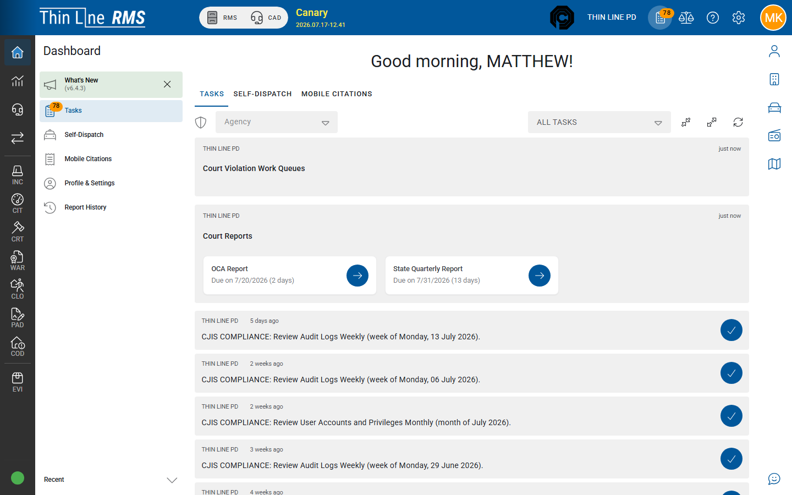

# Journeys

Cross-module (and often cross-agency) paths that show how everyday work moves through Thin Line. Use these after [Dashboard](../dashboard.md), [Modules and navigation](../modules-and-navigation.md), and [Working across agencies](../working-across-agencies.md); open the linked module guides for screen-level detail.

## Journeys in this guide

| Journey | Audience | Path |
|---------|----------|------|
| [Law enforcement: stop to report](law-enforcement-stop-to-report.md) | Patrol / records | Citation and/or incident → evidence → (optional) court |
| [Court payment to accounting](court-payment-to-accounting.md) | Court clerks / finance | Case payment → acceptance → deposit / ledger → (optional) collections |
| [CAD call to incident](cad-call-to-incident.md) | Dispatch / officers / records | Live call → clear → RMS incident |
| [Arrest to jail booking](arrest-to-jail-booking.md) | Patrol / intake | Incident arrest → booking → Accept (facility agency) |
| [Court warrant to LE service](court-warrant-to-le-service.md) | Court / warrant desk | Issue FTA/CPF → COURT OWNED → service attempts → execute / recall |

## How to use

1. Walk the journey in a **training tenant** with sample data.
2. Confirm **agency** and **RMS / CAD / JAIL** mode at each handoff ([Working across agencies](../working-across-agencies.md)).
3. Keep [master records](../master-records/README.md) habits (search before add) at every person / vehicle / location step.
4. Stop and open the linked module page when a step needs field-level detail.

## Related

- [Working across agencies](../working-across-agencies.md)
- [Dashboard](../dashboard.md)
- [Getting started](../README.md)
- [Training](../../training/README.md)
