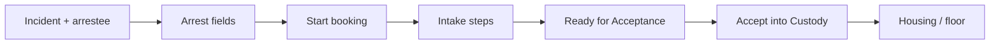

# Journey: Arrest to jail booking

From an RMS arrest on an incident through jail intake and **Accept into Custody**.

## When to use this journey

- Training patrol, records, and jail intake together  
- Agencies that book from street arrests into a Thin Line Jail facility  
- Clarifying **PD agency** vs **jail facility agency** in the header  

## Path overview

## Steps

### 1. Complete the arrest on the incident (LE agency)

1. Confirm the header agency is the **arresting / records PD** ([Working across agencies](../working-across-agencies.md)).  
2. Open the incident → involved **Arrestee** (or equivalent).  
3. Complete arrest fields ([Arrests and affidavit](../../rms/incidents/arrests-and-affidavit.md)).  
4. Use **Booked in Jail** (when shown) only as a case indicator — it does **not** replace Jail Intake.  
5. Link warrants or related records when policy requires ([Related records](../../rms/incidents/related-records.md)).

### 2. Start the booking (jail)

1. Switch header mode to **JAIL** when you are ready for intake.  
2. Switch the header **agency** to the **jail facility** agency if it differs from the PD.  
3. Start a booking ([Start a booking](../../jail/start-a-booking.md)):  
   - Header **JAIL** → **Add Booking**, or  
   - **Jail Intake** → **Booking Add**, or  
   - Agency-enabled path from the incident / arrestee when configured.  
4. In the wizard: **Select Person** (prefer master match) → arrest details → facility details → **Create Booking**.

### 3. Complete intake

1. Work required [intake steps](../../jail/intake-steps.md) until status is **Ready for Acceptance** (or your agency’s equivalent).  
2. Keep person / property / medical data consistent with masters and the incident.  
3. Do **not** Accept from the wrong facility agency — Accept will fail or be missing ([Accept into Custody](../../jail/accept-into-custody.md)).

### 4. Accept into Custody

1. Confirm facility agency in the header.  
2. **Accept into Custody** from the Command Center / booking UI.  
3. Continue housing, observation, and floor workflows ([Jail](../../jail/README.md)).

### 5. Optional warrant and court context

- Active warrants may need service / recall coordination with Court and WAR — see [Court warrant to LE service](court-warrant-to-le-service.md).  
- Court cases for the same person are separate records; jail does not replace Court Violations.

## Agency reminder

| Step | Typical agency |
|------|----------------|
| Incident / arrest fields | LE (PD) |
| Create booking / intake / Accept | **Jail facility** |
| Court FTA / payments | Court |

## Tips

- Search the master person before creating a new booking identity.  
- If Accept is missing, check facility agency + booking readiness — [Troubleshooting](../../support/troubleshooting.md).  
- Delete only **draft** bookings per policy; after Accept use [Release](../../jail/release.md).

## Related

- [Working across agencies](../working-across-agencies.md)
- [Jail — Start a booking](../../jail/start-a-booking.md)
- [Incidents — Arrests](../../rms/incidents/arrests-and-affidavit.md)
- [Jail intake role](../../training/roles/jail-intake.md)
