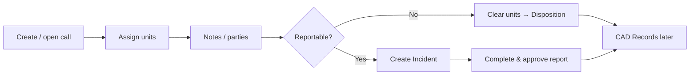

# Journey: CAD call to incident

From a live call for service through unit response and into an RMS incident report.

## When to use this journey

- Training dispatchers with officers and records
- Agencies that create most incidents from CAD (not only manual Add)

## Path overview

## Steps

### 1. Work the live call

1. Switch header mode to **CAD** ([Live CAD overview](../../cad/live-cad-overview.md)). Confirm the correct agency if you work a shared board ([Multi-agency CAD](../../cad/multi-agency-and-related-records.md)).
2. **Add Call** or open an existing call ([Create and update a call](../../cad/create-and-update-a-call.md)).
3. Set **Call Type**, **Priority**, **How Reported**, and **Location**.
4. Assign units; update En Route / Arrived / Clear as your agency enables ([Assign and clear units](../../cad/assign-and-clear-units.md)).
5. Add notes, persons, and vehicles on the call sheet ([Call sheet activity](../../cad/call-sheet-activity.md)).

### 2. Officer self-dispatch (alternate start)

1. Open [Dashboard](../dashboard.md) → **Self-Dispatch**.
2. Follow [Self-dispatch](../../cad/self-dispatch.md) (unit must be assigned to the user).
3. Continue status updates for your own unit.

### 3. Decide whether an incident is required

Follow your agency’s reportable-event rules. Not every cleared call needs an incident.

### 4. Create or link the incident

1. On the call sheet, open **Related Incidents & Citations**.
2. Choose **Create Incident** (agency unit must be on the call) — or **Link Existing Record** if the incident already exists.
3. Complete the incident in RMS ([Related incidents and citations](../../cad/related-incidents-and-citations.md), [Incidents](../../rms/incidents/README.md)).
4. Add property / evidence when taken ([Law enforcement journey](law-enforcement-stop-to-report.md)).

### 5. Dispose the call

1. Clear all units.
2. Set **Disposition** ([Dispose and close a call](../../cad/dispose-and-close-a-call.md)).

### 6. Research later

1. Switch back to **RMS**.
2. Use [CAD Records](../../cad/records/README.md) — not the live board.

## Common failure points

| Symptom | What to check |
|---------|----------------|
| Cannot open CAD | Claims + agency CAD enablement; header mode |
| Create Incident disabled | No unit from that agency on the call |
| Disposition missing | Units still active on the call |
| Cannot find old call | Use CAD Records, not live CAD |
| Self-dispatch blocked | User not assigned to a CAD unit |

## Related

- [CAD](../../cad/README.md)
- [CAD workshop](../../training/cad-workshop.md)
- [Law enforcement: stop to report](law-enforcement-stop-to-report.md)
