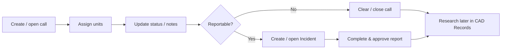

# Journey: CAD call to incident

From a live call for service through unit response and into an RMS incident report.

## When to use this journey

- Training dispatchers with officers and records
- Agencies that create most incidents from CAD (not only manual Add)

## Path overview

## Steps

### 1. Work the live call

1. Switch header mode to **CAD** ([Live CAD overview](../../cad/live-cad-overview.md)).
2. Create or select the call for service.
3. Enter location, call type, and priority.
4. Assign units; update status as they respond, arrive, and clear.
5. Add people / vehicles / notes on the call as information arrives — prefer [master records](../master-records/README.md) when linking known parties.

### 2. Officer self-dispatch (alternate start)

When policy allows officers to start their own calls:

1. Open [Dashboard](../dashboard.md) → **Self-Dispatch**, or use the self-dispatch path in CAD.
2. Follow [Self-dispatch](../../cad/self-dispatch.md).
3. Continue from unit status updates as in step 1.

### 3. Decide whether an incident is required

Follow your agency’s reportable-event rules. Not every cleared call needs an incident.

### 4. Create or open the incident

1. Use the product action on the call to create / open a related [Incident](../../rms/incidents/README.md) (wording varies by build — see [CAD and incidents](../../cad/cad-and-incidents.md)).
2. Complete narratives, offenses, and involved persons in RMS.
3. Add property / evidence when taken ([Law enforcement journey](law-enforcement-stop-to-report.md) steps 3).
4. Submit for approval ([Workflow, versions, and approval](../../rms/incidents/workflow-versions-and-approval.md)).

Keep call number and incident number associated so records can find both later.

### 5. Clear the call

1. Update final unit status and disposition codes on the call.
2. Close / dispose the call per agency practice.

### 6. Research later (do not use live CAD)

1. Switch back to **RMS**.
2. Use [CAD Records](../../cad/records/README.md) — Call Sheets, Unit Logs, Dispatcher Notes — for history and public information requests.

## Common failure points

| Symptom | What to check |
|---------|----------------|
| Cannot open CAD | Claims + agency CAD enablement; correct header mode |
| Incident has wrong location / person | Masters not linked; edited only on the call copy |
| Cannot find old call | Searching live CAD instead of CAD Records |
| Duplicate incidents for one call | Confirm whether an incident already exists before creating another |

## Related journeys

- [Law enforcement: stop to report](law-enforcement-stop-to-report.md)
- [CAD](../../cad/README.md) · [Incidents](../../rms/incidents/README.md) · [Dashboard](../dashboard.md)
