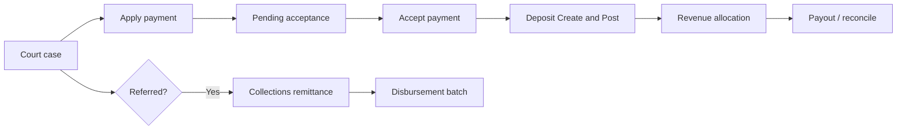

# Journey: Court payment to accounting

From a court case payment at the window through acceptance, deposit, and optional collections.

## When to use this journey

- Training clerks and cashiers with finance staff
- Go-live rehearsal for Court + Accounting (+ Collections when used)

## Path overview

## Steps

### 1. Open the case

1. Work in [Court](../../court/README.md) — search or open from a [work queue](../../court/work-queues.md).
2. Confirm the defendant, balance, and payable state ([Case lifecycle](../../court/case-lifecycle.md)).

### 2. Apply payment (cashier)

1. Follow [Court — Payments](../../court/payments.md): **Apply Payment/Credit**.
2. Enter amount, method, and date.
3. Submit. Payment is **pending acceptance** until accepted.

Card processor success ≠ court acceptance.

### 3. Accept payment

1. Open the payment acceptance work queue (**Accept Payment** / **Batch Accept Payments**).
2. Review and accept.
3. Provide the **final receipt** after acceptance.

See [From Court payments](../../accounting/from-court-payments.md).

### 4. Payment plans (when not paying in full)

1. Set up the plan on the case ([Payment plans](../../court/payment-plans.md)).
2. Finance may inquire in [Accounting — Payment Plans](../../accounting/accounts-fees-and-plans.md).

### 5. Accounting close-out (finance)

1. Open [Accounting](../../accounting/README.md) (court agency + access).
2. **Deposit Batch** → **Create & Post Batches** ([Deposit batches](../../accounting/deposit-batches.md)).
3. **Revenue Allocation Batch** → **Create & Post Batches** ([Revenue allocation](../../accounting/revenue-allocation.md)).
4. For online card: [Payment Ledger / Payouts](../../accounting/online-payments-and-payouts.md) and [Reconciliation](../../accounting/reconciliation-and-disputes.md) (prefer VerifyOnly).

Cashiers stop at apply + accept. Create & Post is finance.

### 6. Collections (when referred)

1. [Refer](../../collections/refer-and-recall.md) from Court when eligible.
2. Confirm [Referred accounts](../../collections/referred-accounts.md).
3. [Payment entry](../../collections/payment-entry.md) or [Payment import](../../collections/payment-import.md).
4. [Disbursement Report / Batches](../../collections/disbursements.md) when paying the vendor.

Do not double-post the same money in Court Apply and Collections remittance.

## Common failure points

| Symptom | What to check |
|---------|----------------|
| “Paid” but no receipt | Acceptance still pending |
| Create & Post shows no pending | Not accepted; wrong agency/date |
| Card payout missing | Sync Stripe Payouts; webhooks |
| VerifyAndHeal surprises | Use VerifyOnly unless finance lead approved heal |
| Collections ≠ Court | Referral status; remittance vs window payment |
| DPS/OCA blocked | Agency identifiers not configured ([Import/Export](../../import-export/README.md)) |

## Related

- [Court finance workshop](../../training/court-finance-workshop.md)
- [Law enforcement: stop to report](law-enforcement-stop-to-report.md)
- [Accounting](../../accounting/README.md) · [Collections](../../collections/README.md) · [Import/Export](../../import-export/README.md)
