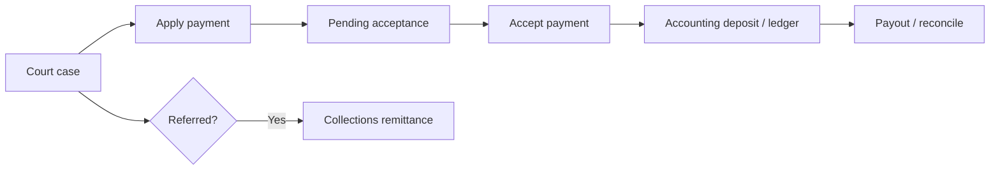

# Journey: Court payment to accounting

From a court case payment at the window through acceptance, deposit, and optional collections.

## When to use this journey

- Training clerks and cashiers with finance staff
- Go-live rehearsal for Court + Accounting (+ Collections when used)

## Path overview

## Steps

### 1. Open the case

1. Work in [Court](../../court/README.md) — search or open from a [work queue](../../court/work-queues.md).
2. Confirm the defendant, balance, and that the case is in a payable state ([Case lifecycle](../../court/case-lifecycle.md)).

### 2. Apply payment (cashier)

1. Follow [Court — Payments](../../court/payments.md): **Apply payment**.
2. Enter amount, method, and date.
3. Submit. The payment is **pending acceptance** until a clerk/judge accepts it.

Card processor success ≠ court acceptance. Do not treat the payment as final for close-out until accepted.

### 3. Accept payment

1. Open the payment acceptance work queue (or the pending payment path your agency uses).
2. Review and **accept** (or correct / reject per policy).
3. Provide the **final receipt** after acceptance.

### 4. Payment plans (when not paying in full)

1. Set up or maintain the plan on the case ([Payment plans](../../court/payment-plans.md)).
2. Finance may also inquire across plans in [Accounting — Payment Plans](../../accounting/accounts-fees-and-plans.md).

### 5. Accounting close-out (finance)

1. Open [Accounting](../../accounting/README.md) (court agency + accounting access).
2. Build / post a **Deposit Batch** for accepted payments ([Dashboard and batches](../../accounting/dashboard-and-batches.md)).
3. Complete **Revenue Allocation** as your city process requires.
4. Use **Payment Ledger**, **Payout Batch**, and reconciliations to balance the period ([Ledgers and reconciliation](../../accounting/ledgers-and-reconciliation.md)).

Cashiers usually stop at apply + accept. Deposit batches are a finance role.

### 6. Collections (when the case was referred)

1. Confirm the account appears under [Collections — Referred accounts](../../collections/referred-accounts.md).
2. Enter or import vendor remittances ([Payments and remittance](../../collections/payments-and-remittance.md)).
3. Run disbursement report / batches ([Disbursements](../../collections/disbursements.md)).

Do not double-post the same money in Court Payment Entry and Collections remittance.

## Common failure points

| Symptom | What to check |
|---------|----------------|
| “Paid” but no receipt / balance wrong | Acceptance still pending |
| Deposit batch missing a payment | Not accepted yet, wrong date, or wrong agency |
| Card payout does not match | Payout reconciliation + Charge Disputes |
| Collections balance disagrees with Court | Referral timing; remittance vs window payment |

## Related journeys

- [Law enforcement: stop to report](law-enforcement-stop-to-report.md) (citation → court intake)
- [Court](../../court/README.md) · [Accounting](../../accounting/README.md) · [Collections](../../collections/README.md)
