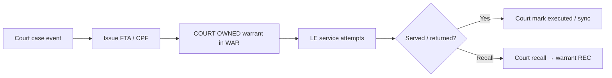

# Journey: Court warrant to LE service

How a court-issued FTA or CPF warrant reaches law enforcement for service, and how each side keeps status aligned.

## When to use this journey

- Court clerks and PD warrant desks training together  
- Agencies where Court creates **COURT OWNED** warrants that LE serves in WAR  
- Clarifying which **agency** header to use at each step  

## Path overview

## Steps

### 1. Court issues the warrant (court agency)

1. Confirm header agency is the **court** agency.  
2. Open the court violation / work queue that needs enforcement ([Court — FTA, warrants, and bonds](../../court/fta-warrants-bonds.md)).  
3. Use **Issue FTA warrant** or **Issue CPF warrant(s)** per case type.  
4. Confirm the linked warrant appears for LE (type/status per your codes).

Clerks do **not** invent a second LE-only warrant to “help” service — that creates duplicates.

### 2. LE finds the court-owned warrant (LE agency)

1. Switch header agency to the **serving PD** (or the LE agency that searches WAR).  
2. Open [Warrants](../../rms/warrants/README.md) → Search.  
3. Locate the warrant (court-owned / FTA / CPF indicators as configured).  
4. Open detail — edits are limited when the warrant is **COURT OWNED** ([Court-owned FTA and CPF](../../rms/warrants/court-owned-fta-cpf.md)).

### 3. Record service attempts (LE)

1. Add diligent **Service Attempts** per policy ([Service attempts](../../rms/warrants/service-attempts.md)).  
2. Print / attach returns as your agency requires.  
3. Complete service / attestation fields when the UI and policy require them for court return.

### 4. Close the loop with Court

| Outcome | Typical court / WAR action |
|---------|----------------------------|
| Served / executed | Court **Mark warrant executed** (or sync from completed service rules); warrant moves toward cleared |
| Court recalls | **Recall FTA warrant** (or CPF recall path) → warrant often **REC** |
| Still outstanding | Leave **ACT** (active); continue attempts |

Exact status codes are ALL CAPS descriptions in your agency lists (`ACT`, `CLR`, `REC`, and related).

## Who does what

| Role | Agency context | Actions |
|------|----------------|---------|
| Court clerk / judge tools | Court | Issue, recall, mark executed |
| Warrant / patrol LE | LE (PD) | Search, service attempts, prints |
| Supervisor | Either | Policy on duplicates, wrong-agency creates |

## Tips

- Wrong agency is the #1 reason a clerk “can’t see” a warrant the PD just served — [Working across agencies](../working-across-agencies.md).  
- Do not clear or “fix” a court-owned warrant by adding a local duplicate.  
- Coordinate recalls before LE assumes the warrant is still serviceable.

## Related

- [Court-owned FTA and CPF](../../rms/warrants/court-owned-fta-cpf.md)
- [Court — FTA, warrants, and bonds](../../court/fta-warrants-bonds.md)
- [Warrants workshop](../../training/warrants-workshop.md)
- [Working across agencies](../working-across-agencies.md)
