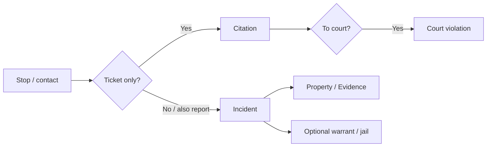

# Journey: Law enforcement — stop to report

From a traffic stop or call for service through records, evidence, and (when applicable) court.

## When to use this journey

- Training patrol and records on the “happy path” across modules
- Go-live rehearsal for citation + incident + evidence agencies

## Path overview

## Steps

### 1. Identify people, vehicle, and location

1. Open [Master records](../master-records/README.md) from the right rail (or from the module lookup).
2. **Search before add** for the person and vehicle ([Search and add](../master-records/search-and-add.md)).
3. Confirm the location master when the stop has a fixed address.

### 2A. Issue a citation (ticket path)

1. Open [Citations](../../rms/citations/README.md) → **Add** (or [Mobile Citations](../../rms/citations/mobile-citations.md) from the [Dashboard](../dashboard.md)).
2. Link person, vehicle, and location ([Person, vehicle, and location](../../rms/citations/person-vehicle-location.md)).
3. Add offenses and complete racial profiling when required ([Offenses](../../rms/citations/offenses-and-warnings.md), [Racial profiling](../../rms/citations/racial-profiling.md)).
4. Move **Draft → Issued** ([Draft to Issued](../../rms/citations/draft-to-issued.md)).
5. Print / attach as needed ([Print and attachments](../../rms/citations/print-and-attachments.md)).

### 2B. Write an incident (report path)

1. Open [Incidents](../../rms/incidents/README.md) → **Add** (or create from a CAD call — [CAD call to incident](cad-call-to-incident.md)).
2. Complete General, narratives, and offenses.
3. Add involved persons / organizations from masters.
4. Add arrests / affidavit when applicable ([Arrests and affidavit](../../rms/incidents/arrests-and-affidavit.md)).
5. Submit for approval per your agency workflow ([Workflow, versions, and approval](../../rms/incidents/workflow-versions-and-approval.md)).

### 3. Book property into evidence (when taken)

1. From the incident, open **Property / Evidence** ([Property and evidence](../../rms/incidents/property-and-evidence.md)).
2. Add property, then take into custody as evidence ([From incident property](../../rms/evidence/from-incident-property.md)).
3. Record chain-of-custody events and print labels as needed ([Evidence](../../rms/evidence/README.md)).

### 4. Send the citation to court (when your agency uses Court)

1. Follow [Citation to court](../../rms/citations/citation-to-court.md).
2. Court staff activate / process the case in [Court](../../court/README.md).

### 5. Optional branches

| Need | Where |
|------|-------|
| Active warrant service | [Warrants](../../rms/warrants/README.md) |
| Booking | [Jail](../../jail/README.md) |
| Field contact only (no report) | [Notepad](../../rms/notepad/README.md) |
| Property check request | [Close Patrol](../../rms/close-patrol/README.md) |

## Common failure points

| Symptom | What to check |
|---------|----------------|
| Duplicate person / plate on the ticket | Search masters before Add |
| Citation stuck in Draft | Draft → Issued steps and permissions |
| Evidence not finding the item | Created from incident property, not only a master |
| Court never sees the ticket | Citation issued + citation-to-court / import path |

## Related journeys

- [CAD call to incident](cad-call-to-incident.md)
- [Court payment to accounting](court-payment-to-accounting.md)
