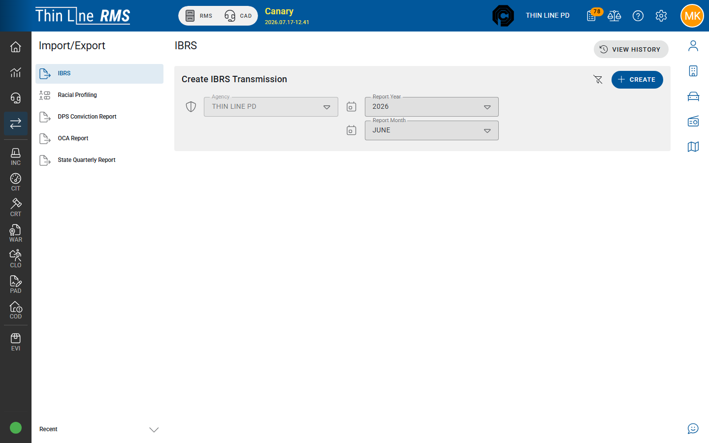

# DPS Conviction Report

Monthly DPS-style conviction reporting pack for court agencies.

## Prerequisites

Agency Admin must have DPS conviction reporting configured (location code and submission file name token). If you see **DPS conviction reporting is not configured…**, stop and escalate to your administrator / Thin Line — you cannot create a valid file until setup is complete.

## Create and download

1. Open **Import/Export** → **DPS Conviction Report**.
2. **Create** — agency, **Report Year**, **Report Month** (often previous completed month).
3. Open the report → **Rebuild** if source data changed.
4. **Download** the file and submit per DPS instructions.
5. Use **View History** for prior periods.

## Data quality

Conviction / disposition completeness on court violations for the month drives the file — see [Data quality checklist](data-quality-checklist.md) and [Court — Reports](../court/reports.md).

## Related

- [OCA Report](oca-report.md)
- [State Quarterly Report](state-quarterly-report.md)
