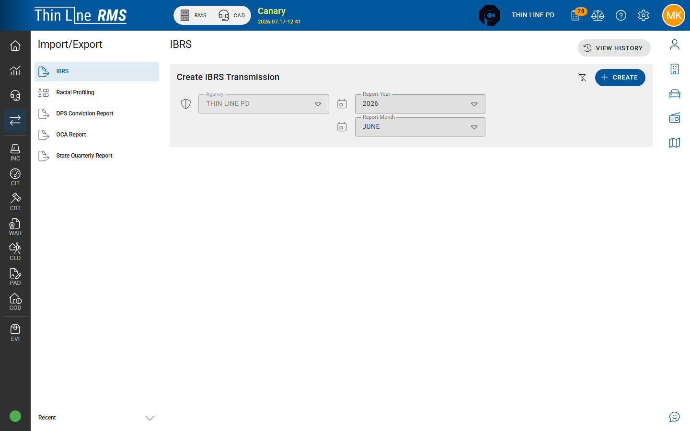

# DPS Conviction Report

Weekly DPS-style conviction reporting pack for court agencies (Sunday–Saturday week).

## Prerequisites

Agency Admin must have DPS conviction reporting configured (location code and submission file name token). If you see **DPS conviction reporting is not configured…**, stop and escalate to your administrator / Thin Line — you cannot create a valid file until setup is complete.

## Create and download

1. Open **Import/Export** → **DPS Conviction Report**.
2. **Create** — agency and **Report Week (Sun–Sat)**. Typical clerk workflow: generate on **Monday** for the prior week; the file is **due Tuesday**.
3. To file several missed weeks in one file, turn on **Catch up multiple weeks**, then choose **First week** and **Last week**. One file covers every Sun–Sat week in that span, up to **26** weeks. The due date is the Tuesday after the last Saturday. The week list goes back about a year while catch-up is on.
4. Open the report → **Rebuild** if source data changed.
5. **Download** the file and submit per DPS instructions.
6. Use **View History** for prior periods.

You can have only one unposted report open. Close that submission before creating another. A report you already completed for the same week does not block a new one.

Court Violations → **Reporting Status** also shows whether the current DPS week is on track — see [Court — Reports](../court/reports.md). A catch-up file counts for every week it includes. To inspect a week or a catch-up span **without** creating a file, use the **DPS conviction** preview card on Court Violations → **Reports** (the same **Catch up multiple weeks** control).

## Data quality

Conviction / disposition completeness on court violations for the week drives the file — see [Data quality checklist](data-quality-checklist.md) and [Court — Reports](../court/reports.md).

## Related

- [OCA Report](oca-report.md)
- [State Quarterly Report](state-quarterly-report.md)
- [Court — Reporting Status](../court/reports.md)
