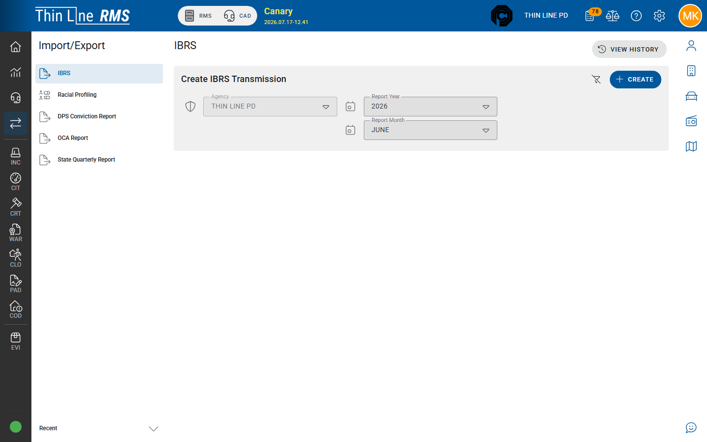

# State Quarterly Report

Quarterly court statistical pack, including remittance columns used for State filing.

## Create and download

1. Open **Import/Export** → **State Quarterly Report**.
2. **Create** — agency, **Report Year**, **Report Quarter** (`Q1`–`Q4`).
3. Open the report → **Rebuild** if needed (generation may show progress while rows calculate).
4. Review column totals on the report details screen before filing.
5. **Download** summary/export options offered on the screen (PDF and GL formats when enabled).
6. Submit per your state’s quarterly calendar.

## Remittance on the report

State Quarterly remittance depends on court fee kits and payments allocated to Due-To-State remittance fees.

1. Confirm remittance fee associations and payment allocation are correct on cases before rebuild.
2. Set the remittance **sent** date when your agency has remitted for the quarter (required before some post/export paths).
3. Use available **GL export** and **accountant report** downloads from the report when your finance process needs them.

## Remittance allocation reconciliation

When remittance fee dollars need review or rebalance against State Quarterly lines:

1. Open **Accounting** → **Remittance Allocation Reconciliation**.
2. Search the period / report context shown on the screen.
3. Review proposed allocations, then verify/apply only when the totals match your finance review.

<mark style="color:red;">**TODO:**</mark> Expand agency SOP screenshots and quarter close checklist once finance training confirms the final button labels for your filing path (Tyler ERP / CentralSquare / local GL).

## Related

- [OCA Report](oca-report.md)
- [Data quality checklist](data-quality-checklist.md)
- [Accounting](../accounting/README.md)
