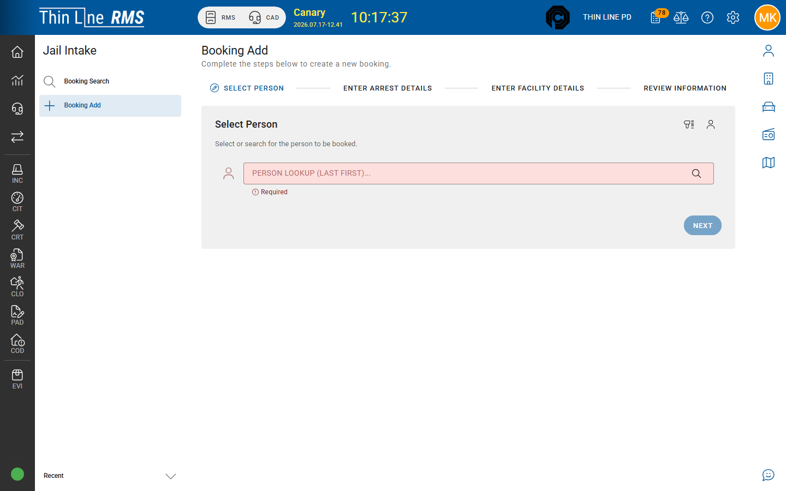

# Complete intake steps

Work the Jail Intake booking step list until the booking is ready for acceptance.

## How steps work

Booking details show a **sidebar step list** and a panel for the selected step. Values typically **autosave**. Use:

| Action | Purpose |
|--------|---------|
| **Mark Complete** | Finish a step when required fields are valid |
| **Re-open for Edit** | Correct a completed step (permissions may limit) |
| **Skip** / **Skip step** | Mark not applicable when allowed |
| **Set step status** | Advanced statuses (for example DEFERRED, BLOCKED, NOT APPLICABLE, PRELIMINARY, TEMPORARY, SKIPPED, REOPEN) |

## Steps in the sidebar

| Step | Role | Notes |
|------|------|-------|
| **Person** | Required | Demographics, aliases, SMTs, mugshot-related work |
| **Custody** | Required | Hold type, times, arresting context — complete before Accept; do not skip |
| **Charges** | Required | Charges; hold-only when no new charge applies |
| **Property** | Conditional | **Add Property Bag**, seal/open; none-collected paths |
| **Mental Health** | Conditional | Screening; defer usually needs a reason |
| **Medical** | Conditional | Screening, meds, withdrawal notes |
| **Classification** | Conditional | Factors and recommended custody level |

**Identity** and **Search** steps exist in the product model but are **hidden** from the current sidebar. Person work may still require an identity snapshot — if you see a message to complete Identity first, finish Person thoroughly and escalate if Accept still blocks.

## Completing a step

1. Open the step from the sidebar.
2. Fill required fields until validation is clear.
3. Choose **Mark Complete** (or the status your process requires).
4. Move to the next incomplete **required** step.

## Defer, skip, reopen

| Action | Typical use |
|--------|-------------|
| **Defer** (status) | Screening cannot finish; capture a **reason** when required |
| **Skip** / NOT APPLICABLE | Step does not apply |
| **Re-open for Edit** | Fix a completed step |

Incomplete **required** steps block **Accept into Custody**. Conditional steps may also block depending on readiness rules — resolve banners before accepting.

## Tips

- Watch the booking **status banner** for what still blocks acceptance.
- Print step PDFs when your agency keeps paper packets ([Reports](reports.md)).
- Coordinate if another user has the booking open (lock / supervisor takeover).

## Related

- [Start a booking](start-a-booking.md)
- [Accept into Custody](accept-into-custody.md)
