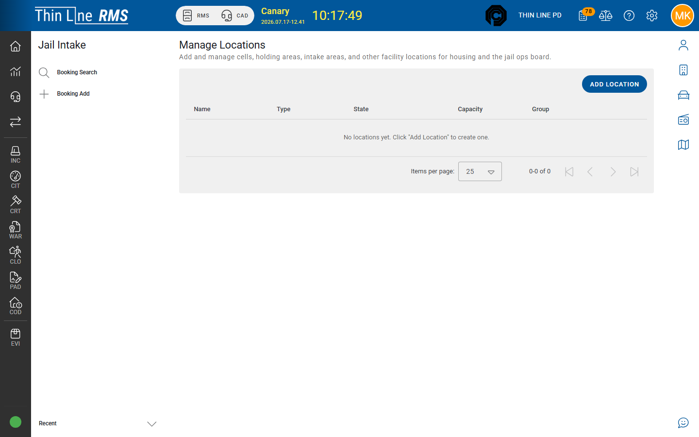

# Manage locations

Configure housing and movement locations for the Jail Command Center.

## Open Manage Locations

1. Open **Jail Intake** (RMS left rail) at a jail facility agency.
2. Choose **Manage Locations** (requires jail access; edits need appropriate modify rights).

## Add or edit a location

1. **Add Location** / **Add Facility Location**, or open **Edit Facility Location**.
2. Set:
   - **Name** (required)
   - **State** (required)
   - **Location Type** (required) — for example holding, intake, cell, court, visitation, offsite (codes are agency-configured)
   - **Group** (optional organizational grouping)
   - **Include in cell checks** — when on, the location participates in **CELL CHECK** scope
   - **Capacity** (required)
3. Save.

## Why this matters

| Setting | Effect |
|---------|--------|
| Missing locations | Officers cannot house people; **Unassigned** grows |
| **Include in cell checks** off | Location omitted from routine cell-check passes |
| Wrong capacity / type | Layout and planning become misleading |

## Tips

- Configure locations in the training tenant before floor training.
- Coordinate naming with how officers speak about pods/cells on the radio.
- Do not delete locations that still have history without an agency archive plan — prefer inactivating when the product allows.

## Related

- [Housing and moves](housing-and-moves.md)
- [Cell checks and observation](observation-and-cell-checks.md)
- [Command Center basics](command-center.md)
