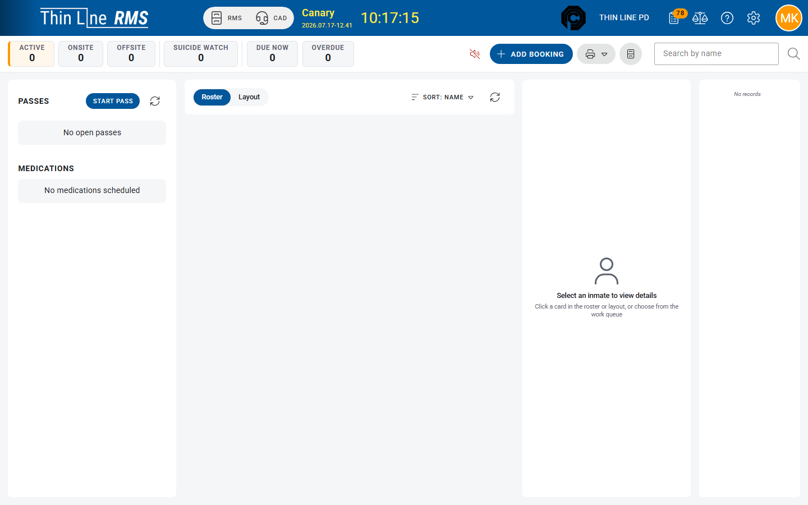

# Cell checks and observation

Run observation passes from the Command Center and review history.

## Pass types (current product)

| Pass type | Typical use |
|-----------|-------------|
| **CELL CHECK** | Routine cell / welfare checks for in-scope housing |
| **SUICIDE CHECK** | Checks scoped to people on **Suicide Watch** |

## Start a pass

1. On the Command Center left panel, open **Passes**.
2. Choose **Start Pass**.
3. Select **Pass type**, **Group** (as configured), then **Start**.
4. Work the **Pass Runner**: **Next unchecked**, mark observations, resolve “need assignment” blockers.
5. **Complete Pass** when finished, or **Cancel Pass** if the run must be aborted per policy.

Progress shows counts such as complete / remaining.

## Who appears on a cell check

Locations with **Include in cell checks** participate ([Manage locations](manage-locations.md)). Inmates may be **blocked** from check until housing is assigned.

Suicide checks focus on people with the **Suicide Watch** critical flag.

## Pass History

1. Open **Jail Intake** → **Pass History** (requires observation access).
2. Search past passes for audit or supervisor review.

## Permissions

**Start Pass** / modify the runner requires **Jail Observation — Modify**. History requires observation access.

## Related

- [Flags, alerts, and medication](flags-alerts-medication.md)
- [Command Center basics](command-center.md)
- [Reports and printouts](reports.md)
