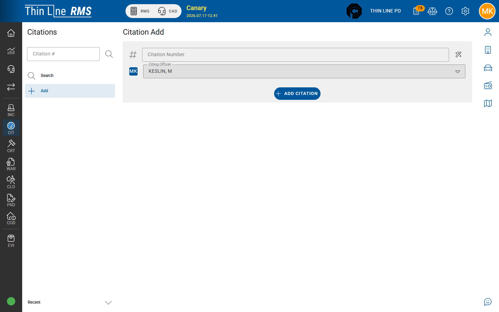

# Add a citation

Create a new citation from the desktop Citations module.

## Who can add

**Add** appears when your user can modify citations **and** the agency allows manual citation create (`Rms.Citation.Modify` plus agency “add manual citation” settings). If **Add** is missing, ask your administrator — some agencies issue only from mobile.

## Create steps

1. Open **Citations → Add**.
2. Enter or **generate** a **Citation number** per your agency’s numbering rules.
3. Select the **Citing officer**.
4. Confirm create (**Add** / **Add Citation**).
5. The citation **detail** opens so you can complete General, Person & Vehicle, Offenses, and other tabs.

New desktop citations start in **DRAFT** until someone marks them **ISSUED**.

## After create

Work through:

1. [General and notes](general-and-notes.md)
2. [Person, vehicle, and location](person-vehicle-location.md)
3. [Offenses and warnings](offenses-and-warnings.md)
4. [Racial profiling](racial-profiling.md) when your agency requires it
5. [Draft to Issued](draft-to-issued.md)

## Tips

- Do not reuse citation numbers. If generate is available, prefer it over inventing a number.
- Search first if you might already have a draft for the same stop.
- Mobile-originated citations follow [Mobile citations](mobile-citations/README.md), not this Add path.
- Support-only **Analyze / Import** (paper OCR) is not the normal officer Add path.

## Related

- [Search citations](search.md)
- [Draft to Issued](draft-to-issued.md)
