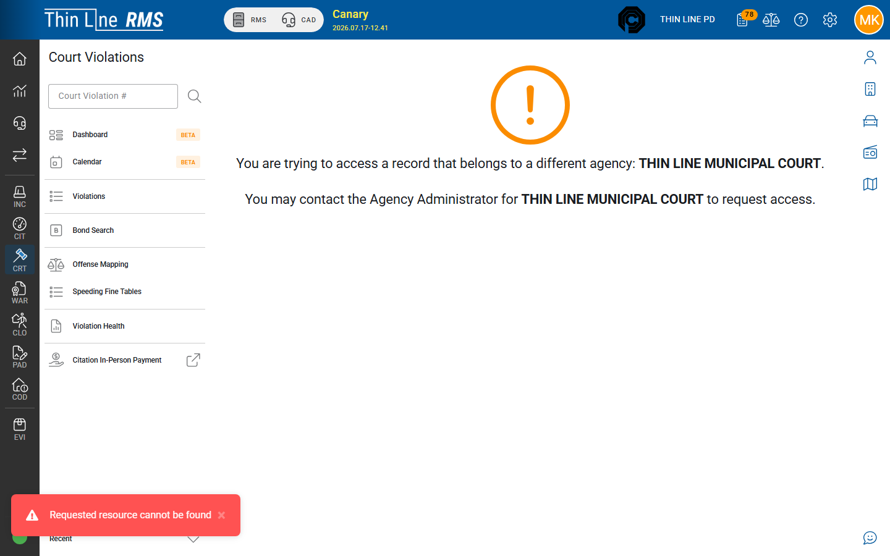

# Citation to court

How issued citations become **court violations** for clerks.

## Relationship

| LE side | Court side |
|---------|------------|
| **Citation** + charging offense line(s) | One or more **court violations** |
| Citing officer / issued ticket | Clerk / judge workflow in Court Violations |

Court processing (plea, judgment, payments) happens in [Court](../../court/README.md), not on the Citations Offenses tab.

## How handoff happens

Depending on agency configuration, court violations may be created:

| Path | When |
|------|------|
| **Automatic** | Citation reaches **ISSUED** (or agency “completed”) and Court is active |
| **Import / catch-up** | Court Citation Import or similar tools (often go-live or support-assisted) |

Your implementation team documents which path your agency uses. Day-to-day, officers should **issue** complete citations; clerks work the resulting violations in Court (for example New Case Review).

### Warnings vs charges

- **Is Warning = yes** lines usually do **not** create court violations.  
- Charging lines (**Is Warning = no**) are what Court expects.  
- Multiple charging offenses can mean multiple court violations for one citation number.

## What clerks need from the citation

Before handoff, LE side should have:

- Correct person and vehicle
- Offenses (warning vs charge set correctly)
- Court / appearance information when used
- **ISSUED** status when your court path requires it

## Finding the court record

1. Note the **citation number** on the LE ticket.
2. In Court, search violations by citation number (or open from New Case Review / work queues when your agency uses them).
3. Continue clerk workflow in [Court](../../court/README.md).

## Voiding and corrections

- **Court void / dismiss / transfer** applies to the **court violation**.
- **Reset for Edit** on the citation (when allowed) is an LE correction path — see [Draft to Issued](draft-to-issued.md).
- Coordinate LE and court before changing an issued ticket that already has an active court case.

## Related Court topics

- [Create and import cases](../../court/create-and-import.md)
- [Getting around](../../court/getting-around.md) (Court)
- [Court clerk workshop](../../training/court-clerk-workshop.md)

## Related

- [Offenses and warnings](offenses-and-warnings.md)
- [Draft to Issued](draft-to-issued.md)
