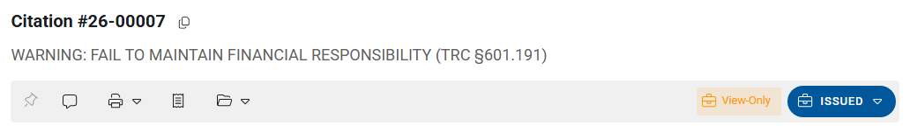

# Draft to Issued

Citation workflow status and how a ticket becomes official.

## Workflow statuses (common)

| Status | Meaning |
|--------|---------|
| **DRAFT** | Desktop citation still being completed |
| **ISSUED** | Citing officer has certified / issued the citation |
| **SYNCED** | Mobile citation waiting for RMS import (see [Mobile citations](mobile-citations.md)) |
| **MOBILE-DRAFT** / **MOBILE-ISSUED** | Mobile-side statuses before or as part of sync |

Exact labels come from your agency’s workflow codes (`_WFC`).

## Mark as Issued

When the citation is complete:

1. Open the citation detail.
2. Open the **Workflow** button (shows current status, e.g. **DRAFT**).
3. Choose **Mark as Issued** (wording may match your `_WFC` transition description).
4. If you are the **citing officer**, confirm the certify / issue prompt.
5. Status becomes **ISSUED**. The citation is largely read-only afterward.

Issuing typically enables official printouts and allows court handoff paths that require an issued citation.

Only issue when person, offenses, and required RP / location data meet your agency’s checklist. Failures surface in a **Citation Validation** dialog — fix the listed items and try again.

### Citing officer rule

Only the **citing officer** can complete the certify-and-issue confirmation in the usual path. Other users with modify rights may still see Workflow options, but issue can fail with a message that only the citing officer may issue. Coordinate with the officer of record (or use Reset for Edit / supervisor process per policy).

## Reset for Edit

Some agencies allow **Reset for Edit** to return an **ISSUED** citation to **DRAFT** so corrections can be made.

Typical limits (confirm in your build):

- Often available for **paper / application** citations
- Often **not** available the same way when court processing is already enabled or when court rules block reset
- Permissions may restrict who can reset

If Reset for Edit is unavailable, follow your supervisor process — do not create a duplicate citation number to “fix” an issued ticket without policy approval.

## There is no LE “void citation” button

Voiding a case in **Court** voids the **court violation**, not the LE citation workflow. Coordinate with court staff when a ticket should not proceed in court — see [Citation to court](citation-to-court.md) and [Court — pleas and judgment](../../court/pleas-and-judgment.md).

## Related

- [Print and attachments](print-and-attachments.md)
- [Citation to court](citation-to-court.md)
- [Mobile citations](mobile-citations.md)
