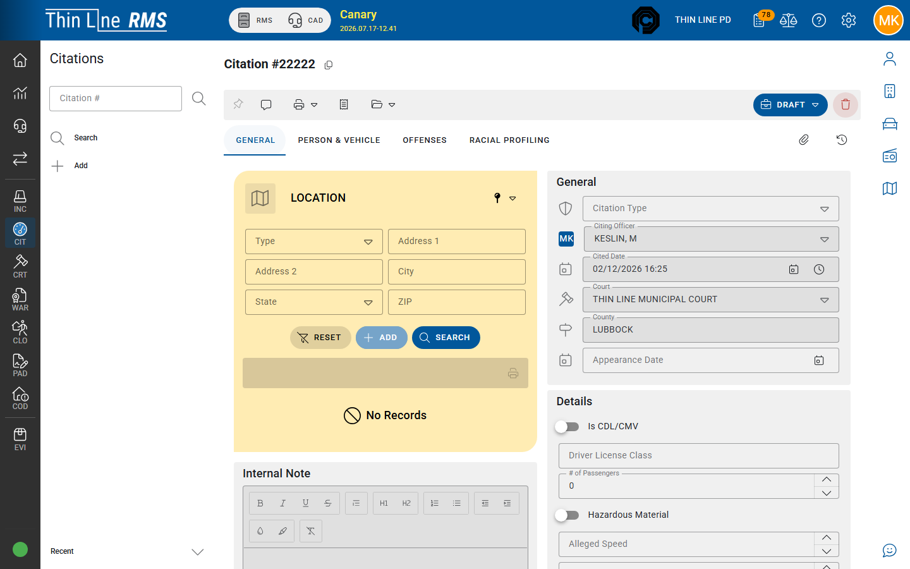
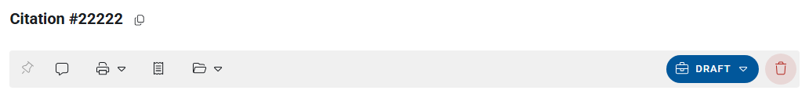

# General and notes

Header and stop details on the citation **General** tab.

## Open General

1. Open a citation from [Search](search.md) or after [Add](add.md).
2. Select the **General** tab (first tab on detail for **DRAFT** / **ISSUED** records).

**SYNCED** mobile imports use the [Mobile Citation Import](mobile-citations.md) stepper instead of these tabs until import finishes.

## Typical General fields

Exact fields depend on citation type and agency settings. Common groups:

| Area | Examples |
|------|----------|
| **Identity of the ticket** | Citation number, citation type, citing officer, cited date/time |
| **Court / appearance** | Court facility, county, appearance / initial appearance date |
| **Stop / vehicle context** | CMV, speed, zone, insurance, and related stop fields when shown |
| **Location** | Stop / violation location (also completed during Person & Vehicle or mobile import) |

Complete required fields before issuing. Incomplete court or appearance data can block clean court handoff later.

## Notes

| Note type | Who sees it |
|-----------|-------------|
| **Court note** | Labeled for the **court copy** — appears on court-facing prints |
| **Internal note** | Agency-only when your role can view/edit internal notes |

Use court notes for information clerks need; keep internal operational comments in internal notes.

## Tips

- Set **citation type** early — it can change which fields matter.
- Appearance date and court should match what you intend for Court Violations.
- Changes after **ISSUED** may be limited; see [Draft to Issued](draft-to-issued.md) for Reset for Edit rules.
- The detail header shows citation number, offense summary, and the **Workflow** status button.

## Related

- [Person, vehicle, and location](person-vehicle-location.md)
- [Citation to court](citation-to-court.md)
